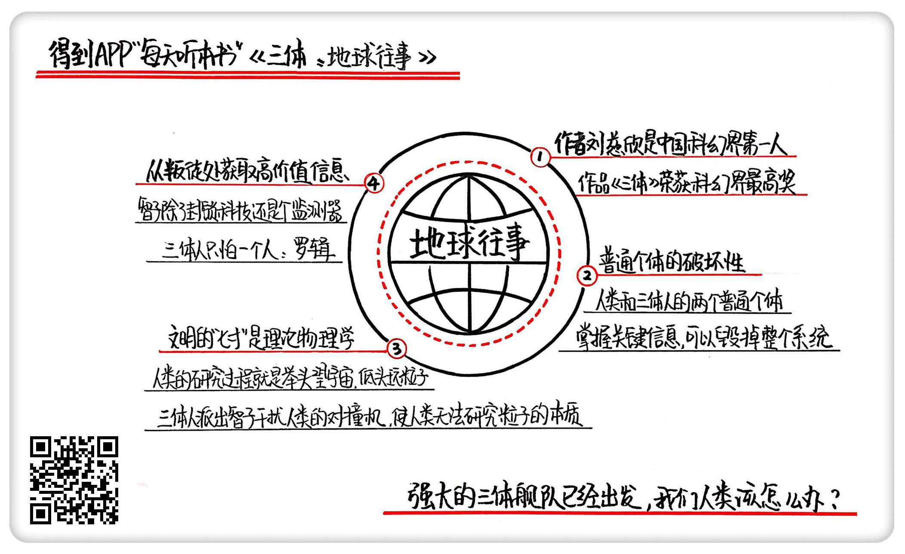
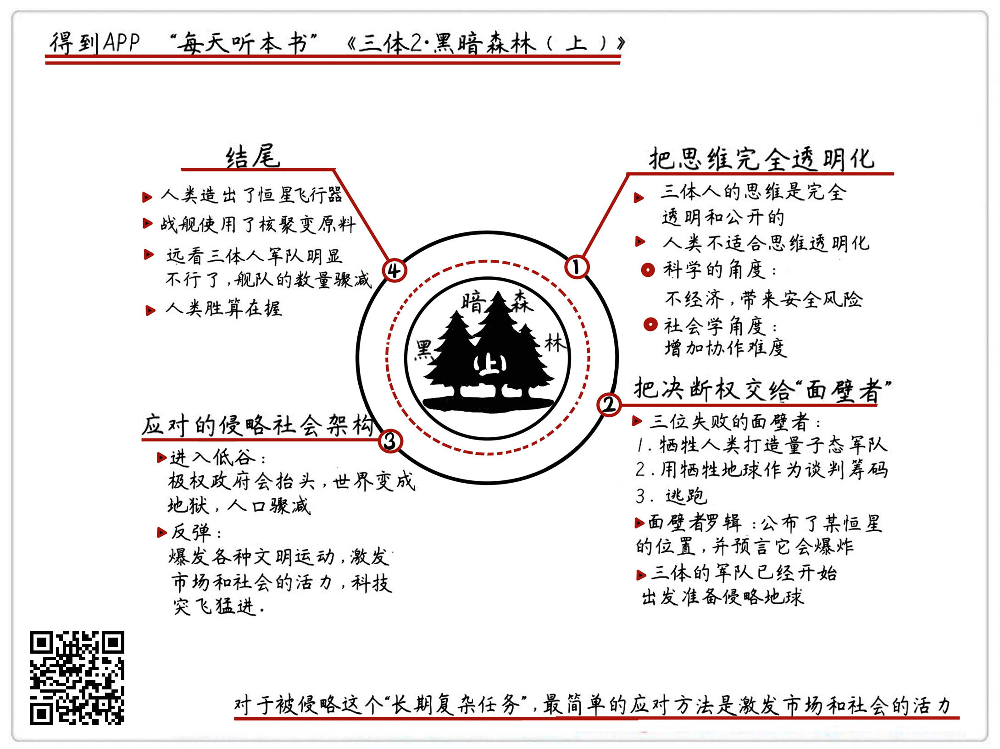
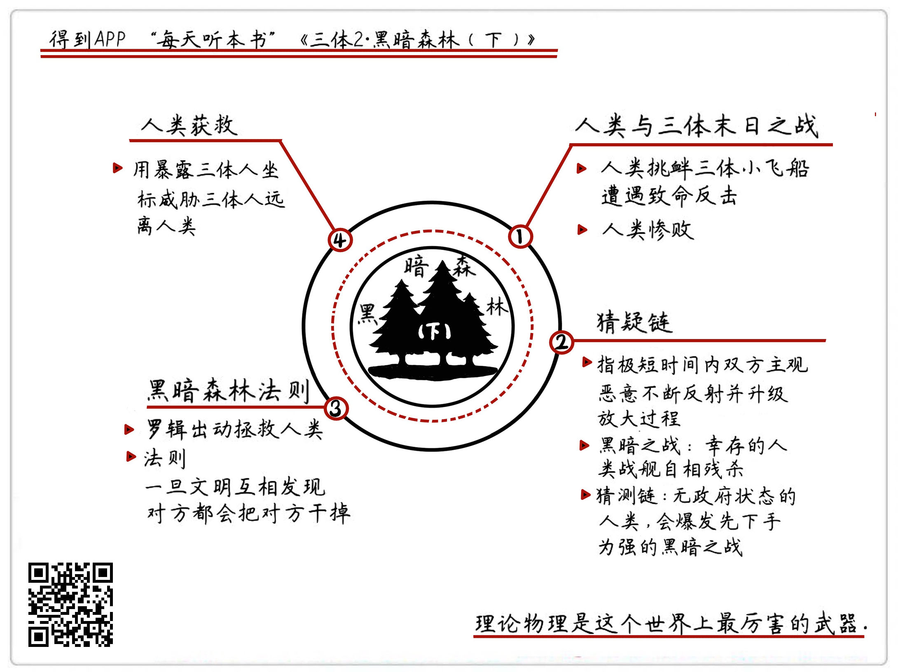
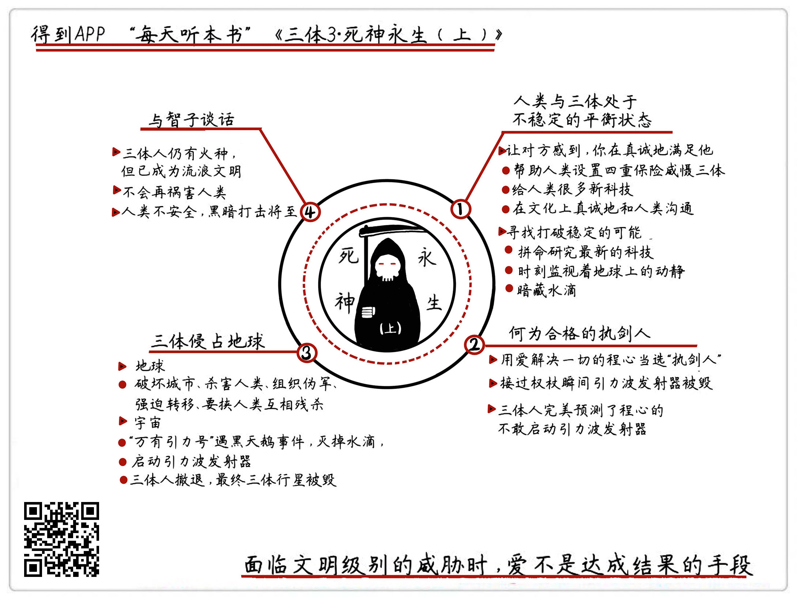

* content
{:toc}

# 《三体：地球往事》

## 关于作者

刘慈欣，科普作家、高级工程师，被誉为“中国当代科幻第一人”。自上世纪90年代开始，他一边在发电厂担任计算机工程师，一边利用业余时间出版了13本小说集，连续数年获得中国科幻文学最高奖银河奖。2015年，凭《三体》获世界科幻界的最高奖项——世界科幻大会颁发的“雨果奖”，这是亚洲作家第一次获此殊荣。

## 关于本书

《三体》是刘慈欣创作的系列长篇科幻小说，由《三体》、《三体Ⅱ·黑暗森林》、《三体Ⅲ·死神永生》组成，讲述的是一个叫“三体”的外星文明与地球文明交流、搏杀以及各自兴哀的故事。这本书是“三体三部曲”的第一部，经刘宇昆翻译后获第73届雨果奖最佳长篇小说奖。

## 核心内容

本书的思想核心是：对人性绝望的天文学家以太阳为放大器，向宇宙发射代表文明的信号，被临近星系的三体人截获，引发了三体人对地球的侵略之心。一小振试图毁灭人类的成员与三体人勾结，成为了叛军，内外夹击之下，地球进入到了生死存亡的危机时刻。

## 前言

你好，欢迎你每天听本书，我是怀沙。以后我在咱们每天听本书里，会集中精力给你说科幻。今天我们来解读的是《三体》三部曲。

《三体》已经非常出名啦，作者刘慈欣，也是中国科幻界毫无争议的第一人，而《三体》就是刘慈欣的代表作。2015年，《三体》第一部获得了世界科幻界的最高奖项，雨果奖。这是亚洲作家，第一次获得这个奖。《三体》的主题也非常刺激，大概讲的是一种叫三体人的外星人来侵略地球，然后地球人奋起反抗的故事。

但是，《三体》最大的价值不是讲了一个跌宕起伏的好故事，让人看得欲罢不能；不是得了什么奖，给中国拨份了。它最大的亮点是，它是一部有相当思想深度的作品。像马云、马化腾、李彦宏、雷军、柳传志、扎克伯格、奥巴马，全都公开表示过，他们是三体的粉丝。2016年，刘慈欣在接受杂志采访的时候说了一句话：“好多名人看完《三体》之后，过来问我的问题，根本就不是一个科幻小说家能回答得了的。”也就是说，很多人在看完《三体》之后，心里萌发了一种对终极问题的渴望。一个科幻小说，怎么会有这样的功能呢？

这是因为《三体》这部小说，可以被看做是一个“思想实验大合集”。这个观点不是我说的，是刘慈欣自己的观点。当然他的原话不是这么说的，他的原话是，“我只写可能的世界”。意思就是，刘慈欣希望在想象里设定一个极端的倩况，然后沿着真实可能的逻辑推理，把可能发的故事写出来。

那我们再提炼一下这句话，其实这就是思想实验的意思。我们先来解释一下什么叫思想实验，它的定义是，使用想象力去进行那些在现实中无法做到的实验。由于所有事都是在脑子里想象出来的，所以做思想实验，就可以设定出特别极端的情况，你不用真的面对极端情况，就能用很低的成本想明白很重要的问题。历史上著名的思想实验，可能就是伽利略扔铁球的实验了。这个实验，在高中物理课上我们都学过。他在比萨斜塔上扔一大一小两个铁球，发现铁球是同时落地的。其实伽利路根本就没到塔上扔球，他就是在脑子里，把这个实验做了。如果这个事靠想就能明白，那就连爬到比萨斜塔上的这个成本也可以省了。

而我们的生活里，其实经常在做思想实验。很多人被迫做过那个经典的思想实验，就是：我和谁谁谁同时掉进水里了，那你先救谁呢？你看，这就是一个现实里不太会发生的极端情况，为什么人们很喜欢问这个问题？是因为他希望在不承担掉水里的风险的情况下，想知道他在你心里有多重要。所以，思想实验就是设定一个情节，用一个真实的故事，让你用最小的代价想明白一些事情。而《三体》的整个小说完美地做到了这点，所有的想象都是真实世界的推理，让你觉得故事里的一切，都是可能发生的。

我们这次讲《三体》三部曲，把将近100万字的作品，切割成了15个问题，也是15个思想实验。同时，听完这15个思想实验，《三体》三部曲的全部故事情节你就全知道了。故事听完了，你的思想也会跟着作者一起回答15个问题，你也能得到15个扎扎实实的收获。过去的时代，是谁知道答案谁牛的时代。而现在这个时代不一样了，很多问题的答案太复杂了，几乎没有正确答案。所以，那些能提出好问题的人是最牛的，是那些能用问题，把所有人的所有知识搅动起来，然后去无限接近真相的人。

我们先说第一部，《地球往事》，原书20多万字，我们把它概括成三个思想实验。第一个思想实验；在信息时代，一个普通个体能在多大程度上破坏系统？第二个思想实验：我们知道打蛇要打七寸，那，打一个文明的“七寸”，应该打什么地方？第三个思想实验：一旦发现系统出现叛徒，最应该做的事情是什么？

## 第一部分

实验1：在信息时代，一个普通个体，能在多大程度上破坏系统？

先亮一个结论吧，小说对这个问题的回答是：在信息时代，一个小小的普通个体，是完全可以毁掉一个系统的。在第一部的故事里，人类和三体人，这两个种族，都各自能被他们阵营里的一个普通个体害死。但是人类被坑得更惨。这两个人的名字分别是叶文洁和1379号三体人。在介绍这两个人之前，我们先介绍一下三体人的大致情况。在离太阳最近的恒星系里，也就是4.3光年之外的恒星系里，有外星人住着，就是三体人。三体人的科技超级厉害，完全超过了人类，但是他们有一个最大的心病，就是自己的行星特别不靠谱。

在他们的恒星系，一共有三个太阳，造成的结果就是，每个太阳都对三体行星有引力作用，这个就是数学上的一个经典问题，叫“三体问题”，也是小说题目的由来。“三体问题”很复杂，结论是，在三体世界，没有任何办法对未来进行精准预测。说大白话就是，没人知道明天会怎么样。可能明天，呼啦一下，三体人的行星就被三个太阳里面大的那俩吸走了，那三体行星表面就热死，没准哪天，又被三个太阳里的那个小弟吸走了，那这个行星就冷死，还可能，突然一下没弄好，老是这么拉拉扯扯的，行星就掉到某一个太阳里去了，那三体人就全玩完了。

所以，三体人就疯了一样想找到靠谱的行星，比如说绕着一个恒星转的行星，然后殖民过去。三体人就在宇宙里监听信号，非常认真地寻找线索，但他们一直不知道，其实在他们旁边，就有一个太阳和地球。

这是一个大背景。就在这个时候，我们人类这边的这个普通个体登场了，就是她把三体人惹过来的，真是把人类给坑惨了。叶文洁，是一位女士，中国人。叶文洁的父母是科学家。本来这是一个很理性的家庭，但叶文洁的父母在“文革”里被迫害死了，所以叶文洁就对人类特别绝望，同时叶文洁又是做科学工作的，她得到了一个便利的机会，能向宇宙发射信号。她就把地球的情况都发到宇宙里去了。这个信号可是三体人做梦都在找的啊。

结果，叶文洁发的信号就被一个叫1379号的三体人收到了。这个1379号算是三体世界的一个底层公务员吧，三体世界是一个特别极权的社会，底层公务员生活特别枯燥，加上这个1379号是一条单身狗，一辈子就是负责监听宇宙信号的，到最后人老珠黄了也没对象，就产生了很强的厌世情结。他就觉得，我这一辈子活得有啥劲呢？而且我们三体人还一心想殖民到外星上去，难道把这种生活方式推广到全宇宙吗？那这么做对吗？我们看，1379号的这种哲学思考当然无对无错，那对于三体人来说，他的这个想法就是错尽错绝了。因为这会耽误整个系统的未来啊。

就在这个时候，叶文洁的信号来了，信号里还附带了地球的信息。这个1379号一看，哇，一颗美丽稳定的行星，太好了，我这辈子就在找这个啊！但是对不起，我现在厌世了，1379号就做了一个特别不靠谱的事。他给叶文洁的回复，劈头就是三句话：不要回复，不要回复，不要回复。重要的事说三遍，我不管你是谁，你如果不回复，在你的这个信号来源上，是有无数颗行星的，我们还是不知道你具体在哪，就永远找不到你，永远找不到你的话，我们过的这种日子，就不会复制粘贴到你们那里去。但如果你回复了，我们是一定会侵略你的。

1379号刚写完这些，啪就发回给地球了。这个行为相当不靠谱，他把千年等一回的机会就这样放过去了，等于他代表所有三体人，做了一个不想活了的决定。结果这个信息刚发走，1379号马上就被捕了。三体人的首领就非常郁闷，以为这个线索就一定是断了，你1379号都这么说了，那傻子才回复呢。结果没想到，在这场比谁更不靠谱的比赛里，叶文洁赢了。其实，是在填补信息漏洞的制度比拼里，地球人败了。叶文洁那边一直没有被捕，所有地球人都不知道有一个叫叶文洁的人，在代表全人类，把三体人这头狼放进来了。

叶文洁收到之后也很吃惊，啊，真的有外星人，而且还是一个不靠谱的外星人，咋还让我别回复呢？这外星人挺有意思啊，还担心我们被侵略。那这不正好吗？我正好觉得人类没希望了，所以叶文洁就回复说，来吧，侵略我们吧，我来帮你们获得地球，我们的文明已经无力解决自身的矛盾了。但就在这个信息马上要发回去的时候，人类这边的信息补漏系统稍微起了点作用，一个领导发现了叶文洁在和外星人联系。叶文洁直接就杀人灭口了，而且为了保密，把自己的老公都捎带着给杀了。等于说，叶文洁是下定决心要把反人类这事进行到底了。

那4年之后，三体人那边就收到了叶文洁的回复，三体人一看都傻了，说还有这么傻白甜的生物吗？而且离得这么近，才4光年，那还说啥，用中国老百姓的话说，“不过了，马上上路吧”，把行星的所有的资源全都用在造飞船上，举三体人全部的力量，开始入侵地球。而人类这边，在相当长的时间里，只有叶文洁一个人知道这个事。

刚才说的这段，就是《三体》在时间线索上的最开始。这匹狼就是这么被放进来的，后来虐了人类几百年，死了几十亿人，所有的所有，都是从这开始的。那我们来看这个思想实验，叶文洁和1379号，两个无名小卒，就把各自的文明的命运揉搓了两遍。那我们看，这种事在人类以前的时代，是不可想象的。在人类历史里，一个个体决定一个民族、一个国家的走向的事情，也不是没有过，但那些都是位高权重的关键人物，至少得是吴三桂这种人吧。你听说过，两个无名小卒，两人聊着天，就把两个文明的命运反过来调过去地改变了两次吗？这个在人类农业社会和工业社会都不会发生。所以一个信息通畅的时代，是赋予了普通个体极大的破坏力的。

而且这里顺便要说一句，《三体》小说里写的这个情节是完全符合逻辑的。霍金在接受采访的时候也说了同样的观点啊，不要和外星人瞎联系，等于霍金在逻辑上是挺了《三体》的。

那我们再看，为什么这一轮三体人赢了。我们刚才提了一嘴，是因为三体人及时修复了1379号的这个信息漏洞，而人类叶文洁这边没有补上，所以这点人类完败，也活该被侵略。而且这些关键信息的泄露过程，可能很无厘头。可能是在一个完全不起眼的节点上，通过一个非常普通的个体，以一个几乎荒诞的理由，在一个你不知道的时候泄露出去了。所以，第一个思想实验给我们的启发就是，那些关键信息，就是有可能让你满盘皆输的信息，一定要保护好。大到一个公司，小到一个家庭，不要让你的关键信息从任何可能的小地方透露出去。我们每个人、每个家庭、公司里有人对关键信息的安全马马虎虎，那你就给他讲讲《三体》的这段情节吧。这可是刘慈欣用人类被坑了的惨痛结果，给我们得出的结论啊。这是第一个思想实验：在信息时代，一个普通个体是可以毁掉整个系统的。

## 第二部分

实验2：我们知道打蛇要打七寸，那打一个文明的“七寸”，应该打什么地方？

还是先亮观点，小说里给的答案很明确，打一个文明的七寸，就是打科技，再具体一点，就是打基础科学。下面我们看看小说是怎么得出这个结论的。刚才我们说到，三体人全副武装来侵略地球了，但是两个行星之间毕竟有4光年的距离，三体人的飞船，只能达到光速的百分之一，所以4光年要飞400年才能到。三体人考虑问题还是非常细致的。首先，三体人在飞船上，他们的科学进步是停滞的，因为飞船太小，资源也不够，没法一边飞一边研究，所以他们现在科学水平啥样，400年后到了地球还是啥样。

那地球人在这400年的时间里，科技会不会反超他们呢？三体人回顾了一下人类的历史，被吓坏了。答案是，不是超过的问题，而是超过多少的问题。你看，人类从旧石器到新石器，用了几百万年，但从冷兵器到热兵器，才用了几百年，然后从热兵器到核武器才几十年，那照这个加速度发展下去，400年后，那人类还不得登天啊，说不定人家冲出来，先把你给灭了。所以，三体人必须用什么东西，把地球人的科技锁住。

那怎么锁呢？三体人只做一件事情，就是打人类的基础科学。说白了，就是打那些看起来没有一点使用价值的科学。这个可能和我们的直觉相反，我们总觉得应该是打击我们的宇宙飞船技术，或者是激光技术、核弹技术。但三体人根本不在乎这些，它攻击的目标全是基础科学。其实这个道理说出来也很简单，打个比方你就懂了。就像我们现在要出发去侵略一群树林里的原始人，但路上要走400年，那在这400年的时间里，这个原始部落出什么事我们最害怕呢？你想，如果这帮原始人成天琢磨怎么提开弓箭的射程，或者怎么在箭头上涂抹哪种吉蛙的毒药更厉害，那我们就很踏实，那随便弄，甚至还挺高兴的，因为这条路走到头也没前途。

但如果有一个原始人成天不务正业，老琢磨一些很没用的问题，比如说成天琢磨石头是什么构成的，木头是什么构成的。那我们就倾向于把这个人干掉，因为他可能是一个化学家。有了化学家，原始人就离造出枪近了一步。同时，如果这个部落里还有一个原始人，每天都研究几何和数学，那我们也倾向于把他干掉，因为他只要能计算抛物线和弹道，他就离造出炮近了一步。所以你看，我们从这个比方里，就能得出两个结论，我们不害怕对方科学的进步，我们害怕的是，敌对文明的科学站到了新的理论台阶上。而能让对方站到新台阶上的，是一开始看上去很没用的基础科学。

所以说，对于刚才提出的问题，怎么打一个文明的七寸，只要让一个文明的基础科学没有进展，就等于给这个文明封了一个天花板。只要你登不了台阶，那不管你在天花板底下怎么折腾，也不会出什么事。

那我们把角色转换一下，现在我们是原始人了，在三体人看来，人类现在是在一个什么层级呢？

2017年，人类的理论物理学，是在大跨步前进的。人类的探索方向，就是极化的两个方向，一个是极大，一个是极小。极大靠望远镜，极小靠对控机。先说望远镜，我们要感谢地球有一个晴朗的夜空，它能让我们用望远镜拼命向外看。这个看的过程，稍微说得不严谨一些，是一个看热闹的过程。看热闹的不怕事大，事情越大，我们的宏观理解就越广阔。所以我们专挑那些大事看，什么超新星爆炸，什么黑洞互撞，什么显系合并之类的，这些都是宏观上的现象。

但看完宏观的现象，我们怎么认识本质呢？答案是，回到微观世界。现在人类发现，整个宇宙有点像一个俄罗斯方块游戏，你别看宇由那么复杂，但在本质上，可能就是由17种粒子，也就是17种俄罗斯方块一样的积木块儿拼成的，这就是现在的“粒子物理标准枝型”，这个在“得到”App订阅专栏《卓老板聊科技》里讲了，感兴趣的话可以去听。这个理论认为，世界就是由17种粒子，通过一些规则相互拼接，拼出了整个宇宙。

所以，我们人类的研究过程可以用一句诗来概括，就是“举头望宇宙，低头玩粒子”。而说了这么多，其实是为了把我们研究粒子的机器引出来，这就是对撞机。对撞机就是把上帝给的这些俄罗斯方块儿，加速到很快的速度，让它们互相撞，在极端的条件下研究粒子的本质。

所以，绕了这么一大圈，我们的结论得出来了，人类这个文明的未来，或者说人类的七寸，就是在对撞机这个点上。如果没有对撞机，我们就傻了。因为我们不知道物质的本质是什么。没有对撞机，你再仰望星空，那就真是看热闹了。三体人就是这么做的。下面，咱们回到小说情节里。

三体人派出了一个叫智子的东西来封住我们的科学。智子是一个多功能的超级微型机器人，它质量只有一个氢原子那么大，所以智子可以被加速到接近光速，只要4年多的时间，就能飞到地球。智子的制造原理非常高大上，三体科学家先在9维空间里建造了一台叫智子的超级机器人。这个机器人结构很复杂，质量也很巨大，在建好之后，再把这台机器人从9维空间折叠到我们所在的3维空间里，折叠之后，就发生一个神奇的现象，就是这台机器人就只有一个普通的氢原子那么大了。就可以很方便被发送到地球上来。智子最重要的作用就是干扰人类的对撞机。智子不能破坏对撞机，但是它可以捣乱，智子可以变成任何一种粒子，用光速在对撞机里穿来穿去，制造大量的假信息，那实验结果就是一团糟。对撞机一旦不好使，就给人类上了一层天花板。这是我们第二个思想实验的内容，一个文明的七寸，就是在它的基础科学上，再具体一些，就是在理论物理上。

那想明白这点对我们有什么收获呢？它能增加我们的智识，它能让我们理解人类文明进程推进的机制。如果你以后再听到有人说，花几十亿造一个什么对撞机，有啥用啊？你就告诉他，人类的福祉，子孙后代的未来，甚至有一天真的外星人来了，我们拿什么跟人家打，就是靠这些。如果你的孩子在物理方面有兴趣，那一定引导他，要告诉他物理不光是一个小球一个小车推来推去做题的，物理是人类的未来，这样他会更有兴趣。还有，我们在生活里，如果遇到物理学家，要记得请他们吃顿好点的饭，听他们聊聊他们在做的事情。好的，这是我们第二个思想实验。下面我们来看第三个。

## 第三部分

实验3：一旦发现系统出现叛徒，最应该做的事情是什么？

我们接着回到小说的故事里，我们之前说了叶文洁。她把三体人引进来了，还在地球上组织了一个叫地球叛军的组织，召集了一帮世界观很独特的人，目标就是配合三体人入侵地球。为了不让人类发现，这帮地球叛军买了一艘大邮轮，这船就不靠岸了，只在海上办公，各种和三体人来来回回地通信，等于说有很多聊天记录吧。天下没有不透风的墙，后来经过一番复杂的斗争，最后人类把叶文洁活捉了，知道了这个邮轮的存在。

这时候问题来了，面对叛徒，我们最应该做的事情是什么？小说给的答案是，干掉他们倒是其次，最重要的，是要获得叛徒和对方的聊天记录。

两个原因，第一，一个叛徒能从前所未有的客观角度，来对你进行判断，因为这话是要说给你的对手听的，所以比说给你听的更大概率是实话，你自己到底什么方面很强，什么方面很弱，这个反馈是有很高的价值的。第二，你能知道对手的重点是什么。中国围棋里有一句话，叫对手的要点，就是你的要点。说的是，棋下到一半，如果觉得局势不明确，那你就跳到对手的角度上，如果你是他，你最希望占到哪个点，那你就落子到那，对方一定很难受。这个道理在今天的商业竞争中也是通用的。从对手向叛徒询问了什么信息，你就能推算出对手的要点是什么。

所以说，发现系统里出现叛徒，第一反应千万不要是把叛徒抓出来，而是要先确保把聊天记录拿到。我们就来看看第一部最后非常精彩的一个段落，来看看人类是怎么拿到这个聊天记录的。首先，直接上船抓捕肯定是不行的，这帮地球叛军全是亡命之徒，和耗子一样警觉，一旦发现不对，马上就会删了聊天记录，然后集体自杀。最后，人类发现，找到了一个千载难逢的机会。就是，这艘船会在某一天通过巴拿马运河。

巴拿马运河是连接着太平洋和大西洋的运河，最窄的地方只有152米，和在河里航行没啥区别。

人类就想出一个方案，就是在巴拿马运河的两边，架起两根高杆子，在杆子中间拉满直径纳米级的超强韧的细线，每隔50厘米一根，这些纳米丝用肉眼看不见，但它们比刀还锋利。如果一艘船从中间开过去，那船上的所有东西，包括船员，就会像切香肠一样，被切成不超过50厘米的肉段。人被切之后就失去行动能力了，来不及删聊天记录。而万一把电脑硬盘切了，切面会很整齐，数据可以恢复。

人类的这个计划非常成功，小说里有一个很形象的比喻，说在切割现场，这艘船就像一沓被向前推开的扑克牌一样。船被切成了一沓50厘米厚的薄片儿，所有地球叛军也都全部当场死亡。在船的废墟里，人类找到了珍贵的聊天记录，一共有28个G。人类打开这些资料，得到了两个非常非常重要的情报，整个后来的故事，全都和这两个情报直接相关。

第一个，智子那个东西，除了是来封锁人类科技的天花板的，还有一个重要功能，就是它是一个无死角，全天候超级监测器，可以说无处不在。人类说的每一句话，三体人都在看直播，而这个传播是超距的，信号不用飞四年，智子看到什么，三体人那边就看什么。第二个信息，就是在整个地球上，三体人只怕一个人，而且派了地球叛军各种暗杀这个人。这个人叫罗辑，很巧，就是罗辑思维的前两个字。但人类非常奇怪，因为罗辑就是一个33岁的普通中国男性，没有任何特殊的地方。但是，刚才说了，敌人的要点就是我们的要点。所以人类开始对罗辑高度重视。

这是我们要说的第三个思想实验。在系统内部发现叛徒，最重要的不是灭掉叛徒，而是获取高价值的信息。想明白这个问题的收获是，在生活里，在职场和创业过程里，是真的可能面对的，那我们要学人类，稳住，怎么能在叛徒不知道的情况下，查看他们在向对手传递什么信息，反推出对付敌人的办法。如果叛徒这个棋子用得好，你会变得比敌人更有利。

## 总结

那说到这，《三体》第一部，《地球往事》的主要情节，也就给你说完了。我们一共说了三个思想实验。

第一个思想实验：信息时代，一个普通个体能在多大程度上破坏系统？小说给的回答是，可以毁掉系统。关键信息一定要谨慎。第二个思想实验：打一个文明的“七寸”，应该打什么地方？小说给的回答是，打理论物理。如果我们平时见到物理学家，我们要尊重他们。第三个思想实验，一旦发现系统出现叛徒，最应该做的事情是什么？答案是，要获取叛徒和对手的聊天记录，对手想抢占的要点，就是你要抢占的要点。

《三体》三部曲之一，《地球往事》，就给你说到这了。我们来看一下局势吧，强大的三体舰队已经出发，大概在450年后，我们的子孙后代会面对这些异星侵略者。他们的科技比我们强，他们用智子封住了我们的科技，他们每时每刻都在偷听我们的信息，偷看我们的资料，那这个仗该怎么打呢？《三体》第二部《黑暗森林》，敬请关注。

撰稿、讲述：怀沙

脑图：摩西

---

#  《三体Ⅱ：黑暗森林》

## 关于作者

刘慈欣，科普作家、高级工程师，被誉为“中国当代科幻第一人”。自上世纪90年代开始，他一边在发电厂担任计算机工程师，一边利用业余时间出版了13本小说集，连续数年获得中国科幻文学最高奖银河奖。2015年，凭《三体》获世界科幻界的最高奖项——世界科幻大会颁发的“雨果奖”，这是亚洲作家第一次获此殊荣。

## 关于本书

《三体》是刘慈欣创作的系列长篇科幻小说，由《三体》、《三体Ⅱ·黑暗森林》、《三体Ⅲ·死神永生》组成，讲述的是一个叫“三体”的外星文明与地球文明交流、搏杀以及各自兴衰的故事。这本书是“三体三部曲”的第二部，人类社会既临三体侵略外患、又陷政治制度内忧，但最终，科技全面勃兴，战舰蓄势待发。

## 核心内容

人类的科技被三体人锁死，行为被三体人监听，人类社会面对严峻的外星人入侵，决定实施“面壁计划”加以抵御。但面壁计划的执行困难重重，人类社会在三体人朝地球行进的日子里，经历了全面的大低谷和大繁荣两个时期，最终恢复信心，准备迎战。

## 前言

你好，欢迎你每天听本书，我是怀沙。我们接着说《三体》系列小说第二部，《黑暗森林》，这一部大概33万字，我们把它分成两段音频来说，现在是上半部分。

我们先来回顾一下《三体》第一部的内容。在离太阳最近的恒星上，有一种叫三体人的外星人。他们的科技领先人类很多，但是他们行星的自然环境特别恶劣，所以打算向地球殖民。三体人朝地球发射了一种叫智子的超级机器人，智子不光能锁死人类的科技，还能实时监控地球人的所有举动。在做好所有准备之后，三体人庞大的舰队杀气腾腾地朝地球出发了，大概在450年之后到达地球。

下面，我们一起进入《三体》系列小说第二部，《黑暗森林》。我们还是用三个思想实验，来概括第二部的内容。

## 上半部分

思想实验1：如果人类社会变成一个思维完全透明的世界，是好事吗？

我们先来看，为什么会提出这么一个奇怪的问题。在人类截获的地球叛军和三体人的聊天记录里，有一个重要信息，就是：三体人的思维，是完全透明的。在三体人那，想和说，是一个词儿。一个三体人在想什么，就一边用电磁波向所有三体人发布，每个人都能接收到。每一个三体人，都是一个永远不休息的电台，只要他没睡着，它就不停地用电磁波散播自己的思想过程。所以，三体人就是一个特别直来直去的种族，整个社会没有欺骗，没有虚伪，没有谎言。他们在知道人类竟然能隐藏自己的想法之后，三体人也吓了一跳，说你们太可怕了。

看到这，很多人就提出一个观点，就是三体人的透明思想，是一种更高级的文明架构方式。我们看人类社会，为什么有那么多丑恶现象，大部分都是因为欺骗、谎言，还有阴谋。甚至有人说，为什么是三体人欺负我们，不是我们欺负三体人，就是我们地球人还在使用这种人心隔肚皮的、落后的沟通方式。这个观点得到了不少人的支持，加上《三体》这本书在创投圈也很出名，很多企业就学会了，说我们要做一个内部信息完全透明的公司。

那我们就接着《三体》提出的概念，来试着推演一下，如果人类社会也变成一个思维完全透明的世界，所有真实的想法和信息都共享，是不是对人类有好处呢？对于这个实验，我们试着从科学和社会学的两个角度来分析。

首先，在科学的角度来说，我们可以给这个生理特点起个名字，叫——被动性全时段内心独白。这个技能肯定不利于人类。因为这么做非常不经济，要知道向外发出信息，是非常消耗能量的。你想，我们平时连续说一小时话都累，那如果一种生物，不停地向外发射电磁波，这个生物要吃多少东西，才能供养得起这么一个奢侈而又没用的行为。而且长期发射电磁波，会给个体带来很大的危险。比如说一个狙击手，要是这么老发电磁波，那就难以隐敲。这是对个体不利的地方。

对于整个种群来说，如果每个个体都是这种话痨型的人格，每个人都是架絮叨叨的，那这个种群筛选有价值信息的成本也变得剧高，会很大地降低种群的沟通效率，这肯定不是好事。所以，被动性全时段内心独白，这个技能从生物属性上看，是又耗能，又添乱。

接下来，我们从社会学来看。答案也是，对人类社会应该不是好事，因为它让人类协作的难度大大增加了。思维太透明了，什么话都直说，人类的很多协作不容易开展。举个例子，比如说谈恋爱，爱情其实也是一种协作，很多时候，很多爱情的开始，双方都没想得太清楚，但走着走着，感情越来越好，最后也是一辈子，挺好，也很有幸福感。但什么都直白了好吗？一个女孩说，我就是图你的钱，一个男孩说，我就是对你有生理需求，很多人是受不了的。结果就是大量的人注定孤寂一生。不光是爱情，我们的企业文化也一样，我们要给员工一个温暖振奋的目标，这样每个人上班的时候心情很好。因为我有好心情，协作效率就很高，最后就能成事。但如果什么都直说，那就没有人有梦想了，可能干劲一下就没了，那这对谁有好处呢？

说得再大一点，越是要把人类聚合成一个团结的组织，一个国家，一个民族，就越是需要一个又虚又大的共同目标。比如说我们要建立一个伟大的国家，但你能保证每个人都是真为了这个目标吗？有的人可能是真为了这个，有的人可能就是想多赚点钱，但是不要紧，没有必要分得那么清楚，只要能拢住更多的人一起往前走，就是有利于这个目标的实现的啊。所以，我们推理下来的结论是，三体人这种啥都透明的沟通方式，可能在三体行星的特殊的环境下，是可行的，但应该是不适合人类的。那我们不能一边享受着信息不透明的高效，同时又要求规避信息透明的缺点，那这就是求全责备了。

那做了这个思想实验之后，我们的收获是什么呢？它能让我们以后再碰到隐瞒、谎言、阴谋的时候，观点不那么简单。你也可能面对一些必要的隐瞒，一些白色灰色的谎言，甚至还有一定程度上的套路，你会是一个宽容的态度。这是我们的第一个思想实验，关于思维完全透明的社会。

下边我们回到小说里，接着讲故事。

思想实验2：如果真有外星人入侵，我们应该把决断权交给谁？

我们之前说了，三体人派了一个叫智子的机器人，任何时候都在监视人类。但智子唯一不能监视的，就是人类的思维。所以，针对这个特点，人类制定了“面壁者”计划。面壁者计划，说得简单点，就是打造人类有史以来最大的四个骗子。

先挑选出四个人类精英，给你最大的权力，你们说什么，人类就干什么。但是，你的所有动作都是为了演戏，演给智子和三体人看的。真实目的，你谁也别说，只有你自己心里知道，要把全人类也都骗过去，最后用一种所有人都想不到的方法把三体人打败。四个面壁者很快选出来了，前面三个面壁者都是牛人，都是非常成功的政治家，而且这三位拿出来的计划都非常狠，但是最后都失败了。只有第4个人没有失败，第4个人就是罗辑，也就是我们之前说过的，三体人唯一害怕的人。罗辑没失败的原因是，他根本没拿出任何计划。

我们先来看一下，前两个面壁者的计划是什么，还有是怎么失败的，这和我们这个段落提出的问题有直接关系。第一位面壁者，是美国前国防部部长。这个人很高大上，他用的战略也很高大上，他的计划是，用量子幽灵部队，去和三体人战斗。解释一下量子幽灵部队，这是一种小说里想象出来的武器。简单说，就是先用一种叫“球形闪电”的武器，攻击人类自己的军队，那人类的军队有可能会被打成量子态。量子态就可以理解成，一个人既在这里，也在那里，既是死亡的，也是活着的，所以，一个量子态的军队，就有点像一支死不了的幽灵部队。那这就很无敌了，大概就是这个意思吧。

客观地说，这个计划是值得一试的。因为打三体人，人类的常规军是一点用都没有的，那还真不如赌一把，万一真有量子态的军队呢，还真的可能有得一打。但很遗憾，这个计划被三体人识破了，三体人的应对办法非常简单，就是直接把这个计划给公布在互联网上了。公布之后，广大不明真相的民众就马上来围观，围观之后就是舆论哗然。反对的声音非常大，大家就说，啊，闹了半天你就是耗子扛枪窝里横啊，打自己人？亏你想得出来，那万一这些人没被打成量子态，就是直接被你真打死了呢？你就是这么拿我们的士兵当小白鼠的吗？反正就是一通质问。

国防部长赶紧出来解释，说我这不还执行呢吗，我就是这么想来着。再说啦，不是说好了，让我当面壁者，就都听我的吗？但人类作为一个群体，就根本不和他进行理性的对话，只是发情绪。因为社会舆论的压力实在太大，人类高层也出来干涉了，说，不行，要不你还是别这么弄了，不然我们的权力基础都不稳了。结果是，在强大的舆论高压下，国防部长最后开枪自杀了。当然他这个自杀的做法也很笨，等于是完全认输了。第一位面壁者，就这么报销了。

第二位面壁者是委内瑞拉总统。他的真实计划是，在水星背对太阳的那一侧，放很多颗氢弹。如果要是引爆这些氢弹呢，就能把水星炸得脱离自己的轨道，最后掉到太阳里去。然后在太阳肚子里就会发生各种链式反应，最后的结果是，地球也会被卷进去。所以，说白了，这个战术不是打三体人的，而是一个要挟性战术，只要你敢过来，我就炸水星，那地球也完蛋了。

这个计划，其实也是非常可行的。这个战术的逻辑就是，我是打不过你，但只要我有毁掉你想要的东西的能力，那我就有谈判筹码。经济学家诺斯说过一句话，一个系统里制度的建立，不是由双方的强弱关系来决定的，而是双方的谈判能力来决定的。而这个计划，就是为了拿到谈判的筹码。

但是，三体人把这个计划也识破了，而且三体人还是老办法，就是把你的计划公布到网上了。和上一次一模一样，老百姓又不干了，说，啊？这三体人还没看着一个呢，听说要先把太阳给炸了？太阳炸了，我们还能活的了吗？这次又是民意汹汹，结果，委内瑞拉总统在一次刚下飞机的时候，被一群愤怒的民众一拥而上，直接给打死了。等于说，这两个面壁者的失败，完全是因为民众的反对。说到这，我们要看一下我们这个思想实验的题干。

面对外星人的入侵，我们应该对普通大众信息透明吗？按照小说的情节看，作者给的答案可能还真是否定的。前两个面壁者的计划，可以说在这样一个烂局势下，几乎是最好的方案了。但只要让普通民众知道了你的计划，就可能有各种不理性的理由反对你，而且只要形成了一股民意汹汹的舆论，你的事情就办不成了。这股民意，它也不负责解决问题，它就只负责反对。至于什么办法行，那我不知道，我又不是政治家，你们再想别的办法。也就是因为三体人也明白这一点，他们的应对才那么简单，就利用你们人类内部的不团结就够了。

那我们再问一句，面对外星人的入侵，可能正确的方法是什么呢？还真的只能是把决定权交给少数人，给他极大的权力，天下一盘棋。再说得残酷一些，这个人甚至要决定哪些人能活，哪些人必须牺牲，在面对外星人入侵的时候，可能只有这样。那这个思想实验给我们的收获是什么呢？但愿我们不会真的遇到外星人入侵这种事啊，那在平时的生活里，如果一件事情，你根本就没什么信息量，对这个事情也根本没有经验，那可能你最正确的决定就是：相信那些信息比你完备，并且和你在一条船上的聪明人。请注意，这个人是不是和你在一条船上，这点非常重要。

这是第5个思想实验，面对像外星的入侵这样的大事，我们该怎么做科学决策。

下面先不说思想实验，接着把另外两个面壁者的故事说完。第三个面壁者，是欧盟主席，他拿出的计划叫——思维钢印。他的表面上的计划呢，是要研发一种叫思维钢印的机器，这种机器可以在人的大脑里强制性地输入观念。他是要给人类士兵都输入一个信念，就是：“在对三体的战争里，人类必胜”。那这么一来，就能得到一群魂斗罗一样的战士。当然，这只是幌子，其实他的真实计划是，在输入信念的时候，偷偷往思想代码里加一个负号，这样一来结果就是完全反了，就从人类绝对能够胜利，变成人类绝对会失败了。

说白了，欧盟主席的计划是一个怎么留住火种的计划。因为他认为，人类肯定是打不过的，与其这么拿鸡蛋碰石头，还不如像武侠小说里说的，保住“少林一脉”。这个计划，能确保无论到什么时候都有一群一心只想着逃跑的人。这个计划倒是成功了，但是三体人也不在乎你是不是留住了少林一脉。所以也懒得管他。这就是前面三位面壁者的情况。

说到这，我们要总结一下，其实这三个计划如果同时实施的话，还真的是很厉害的。我们看这里面，第一个是负责打的，第二是负责谈的，第三个是负责跑的。同时实施，鸡蛋放三个篮子里，每个都值得奋力一搏。那我们来看看第四位面壁者，也就是第二部小说的主人公罗辑。罗辑就是普通人一个，我们前面说了，他能当上面壁者，因为他是唯一一个三体人希望除掉的人。三体人谁也不怕，只怕罗辑。但是为什么，没有人知道。

只有一个可能的原因，就是罗辑是叶文洁女儿的高中同学，所以借着这个关系呢，罗辑曾经见过叶文洁一面。那次俩人见面一共就聊了半小时，但说了什么，人类不方便问，因为智子都听着呢，所以，人类就希望，但愿是什么特别厉害的信息吧，所以就让罗辑当了面壁者。这天，罗辑终于干了一个看起来像面壁者该干的事儿。

他让人类公布了一个宇宙里恒星系的位置，公布的方式是，公布了这颗恒星和其他恒星系的相对位置，比如，离A恒星多远，B恒星多远，如果有一个高级文明拥有宇宙三维立体全景图，就可以用这些信息到全景图里去进行大数据的匹配，就能筛选出这组信息说的是哪个恒星系。发完这个信息之后，罗辑预测说，这个恒星星系在未来会遭到毁灭性的打击。虽然所有人都觉得莫名其妙，但还是照着做了。罗辑干完这件事，就说他没啥要做的了，他要申请冬眠了。当时人类掌握了冬眠技术，罗辑说那个恒星什么时候爆炸了，什么时候叫他，然后就睡觉了。上面就是四个面壁者的情况。

在罗辑冬眠之前，人类又收到了一个大大的坏消息。哈勃望远镜在宇宙里，看见了三体人的舰队。在太阳系和三体人的恒星系之间，有一片星际尘埃带，这个星际尘埃带里突然出现了1000多条整整齐齐的飞船尾迹，就像人在雪地里走过留下的脚印一样。这下，三体人是千真万确地来了。人类就是这种眼见为实的性格，这下民众的反应就完全不一样了，政治格局一下子又紧张起来了。

接下来，我们就进入下一个思想实验。

思想实验3：如果面对外星人的侵略，我们应该采取什么样的社会架构来应对？

我们先来看小说里的故事是怎么发展的。看见三体人来了，这是一个非常重要的背景，因为社会一下达成了共识，现在不是你们科学家在预言了，而是真的来了。而且这次的外敌入侵和之前的全不一样，这个侵略者占领地球之后，是不会和我们发生民族融合的，人类就死定了。一旦形成共识，就会导出一个结果，就是极权政府会抬头。结果，整个世界进入了一次极权政府回归的潮流。

在文化上，政府开始管控文化。在经济上，就会开始推行平均主义，放弃自然经济，最后干脆使用配给制，粮食、物资全都由政府配给。结果，这样的政治体制和经济政策，带来一个结果，就是三体人还没来呢，人类社会自己先崩溃了。人类进入了一个叫大低谷的时代，先是经济崩溃了，各地银行出现挤兑潮，后来很多国家的政府宣布破产，结果一发不可收拾，各地进入无政府状态了。你看，人类本来是想振奋一下，往高处蹦一下，结果反而是一头栽倒在地上了。人类进入了一个从来没有过的黑暗时期，整整50年，地球变成了地狱，到处都是人吃人，暴徒横行，世界人口从83亿降到了35亿，死了50亿人啊。

这是这个思想实验的前半段，等于小说又在虚拟的情节里，把破坏自然经济的可怕后果又给我们演练了一遍。其实，这种亏人类吃得不少了，这个道理早就想明白了。当然这次也是情有可原，这不是外星人要来嘛，算是特殊情况吧，所以一时糊涂又给忘了。作者在小说里，讲述了一个可怕的故事，给我们又提了一次醒。

那我们再来看看这个思想实验的下半段，在大低谷的尾声，也就是2080年左右，人类世界开始触底反弹了，爆发了第二次启蒙运动，第二次文艺复兴。人类就是这样，经历了苦难之后，会出现一大拨哲人，进行一大拨反省。这次人类提出了一句掷地有声的口号，叫：“给岁月以文明，而不是给文明以岁月。”大概的意思是，宁可像一个人一样被三体人灭掉，也不能像蚂蚁一样赖活着。要是不文明，再有岁月也没意义，就是活得再长也没意义。

人类想明白这些之后，各国也都不搞集中生产了，也不教民众怎么做人了，每个人的心情都是，别跟我说什么战胜三体人，什么远大理想，别跟我扯这些，我们就想过好眼前的小日子，穿西装，看手表，文明一秒是一秒。

没想到，因为个体的解放，自由交易的恢复，整个社会的活力反而给调动起来了，全世界的经济也振兴了。经济一好，各种科技水准也追上来了。当然，智子还在上面封着人类理论物理的天花板，但是不影响各种应用技术突飞猛进。在接下来的这100年时间里，人类的文明蹭地一下就又站起来了，而且还反超了之前的科技水平。那这时候人类的信心就又回来了，说哎，我们本来是想最后过一段快乐文明日子的，现在反而更厉害了。那我们是不是应该研发一下战舰呢，试着打一打呢？结果，人类这一研究，就彻底厉害了，反而有了捍卫地球的信心了。关于人类的武器怎么厉害，等一会我们再说。我们先来看一下人类的这次经济和科技的振兴。其实也很好理解，政治上松绑，自然给经济释放了活力，经济繁荣之后，科技当然也就突飞猛进了。

这个段落，小说带着我们来了一次大畅想，这是一个涉及政治学、社会学和经济学的大型思想实验。我们来看，这段人类的历史一共180年，分成两块，前80年和后100年。前80年，人类主观上想富国强兵，但是结果反而是民穷财尽。后100年呢，人类在主观上是想顺其自然，结果反而是富国强兵了。这个事怎么和我们的直觉这么相反呢？

其实，这个事情的主要问题，就出在外星人降临地球的时间上。我们来做一个假设，如果三体人到达地球的时间不是400年，而是4年，那之前人类的做法可能情有可原，比如经济上施行配给制，军事上甚至强征公民入伍。当然可能结果还是打不赢，这么做是在短期内，能快速提升人类这个种族的战斗力的。因为在4年内迎战敌人，这个任务是一个“短期单一任务”，通过这样的社会资源配给方式，就可以最快地实现，而且会非常有效。

但是，如果任务是在400年的时间里，实现富国强兵，打败一个我们还没见过的敌人。那这就是一个标准的“长期复杂任务”，那怎么应对这种任务呢？其实还是那个最简单的方法——激发市场和社会的活力。目前人类找到的有效方式，就是让每一个人类个体自由地表达天性，想唱歌的唱歌，想娱乐的娱乐，把每个人的需求都卷入到社会协作里，这个社会才可能有科技上的创新。举个例子，怎么能造出更好的战舰，不是让每一个人去做科研，而是尊重每个人的需求，只有每个人都想要一台更薄更时尚的手机的时候，商人们才有动力去生产更薄的芯片，那我们的宇宙飞船才能用上更薄的，经过市场检验的好芯片。这个做法可能在一开始是有点反直觉的。但在小说里，我们看到，就是因为人类先用生理反应代替了理性选择，才绕了那么大一个弯路的。

所以，我们第6个思想实验，如果面对外星人的侵略，我们应该采取什么样的社会架构来应对？小说里给的回答是，这个问题不好说，我必须反问一个问题，这个外星人到底什么时候来呢？

## 总结

下面我们回到小说里去。人类经过了这次波折之后，反而变得厉害了。下面在我们这个音频的最后，我们就来看一下，人类战舰有多厉害。

人类的主战武器，叫恒星级飞船，是一种可以进行星际航行的超级战舰，长度大概是几百米，每艘战舰有2000多名船员，飞船可以以15%的光速前进，这个速度是超过了三体人的舰队的。人类战舰使用核聚变原料，总部在人类木星基地，舰队的机动性很强，完全可以驶出太阳系，到外层空间里截击三体舰队。恒星级战舰有可怕的破坏力。这种恒星级战舰，已经服役的有2175艘，人类还在继续生产。而且，再反观三体人那边，明显已经不行了。人类一直在监视三体舰队，发现他们在穿过下一片星云物质的时候，舰队的数量已经从1000艘下降到300艘左右了，而且舰队的队形非常零散，非常混乱。这支破败的舰队将在200年后到达地球，如果它们还敢来的话，一定是来挨揍的。

说到这，《三体2·黑暗森林》的上半部分，就给你说完了。在下面的音频里，三体世界的一支小分队将光临太阳系，双方将发生第一次交战。

## 下半部分

你好，欢迎回来，我们接着说《三体》系列小说第二部，《黑暗森林》的下半部分。前面我们说到，人类在经过了一轮大低谷之后，迎来了一次大繁荣，人类造出了实力超强的星际舰队。而三体人那边，在长途星际航行里，自己就损失惨重了，现在已经只剩三分之一的舰队了，所以人类认为这场星际战争，是赢定了。

我们还是用三个思想实验来概括我们的整个音频。在进入这个音频的三个思想实验之前，我们来一段轻松的段落，我们来看看在小说里，人类繁荣强盛的未来是啥样子。

让世界发生重大改变的，主要是两个核心技术，一个是基因改造技术，一个是可控核聚变技术。首先，可控核聚变技术，使得能源就彻底不是问题了。人类说了几百年的省水、省电，全都彻底被淘汰了。电变成最不缺的东西了，在未来，电源就像是现在的wifi信号一样，是无线充电的，只要电器进入电场马上就能供电。基因改造技术越来越强大，所有人类需要的粮食和经济作物，全是从工厂里生产出来的。人类给植物提供最强的全光谱的照明，超级基因水稻，在强烈的阳光照耀下，一礼拜就收一季。人类就彻底消灭了饥饿。

不需要开采石油了，不需开采矿产了，也不需要种粮食和作物了。人类也就不需要土地了，一些人类你争我夺了几百年的地方，突然就没人要了。传统意义上的地理因素变得越来越不重要，原来的传统国家也衰败了。世界政治格局里，兴起了一种新的政治实体，叫做舰队。舰队集中了最多的资源，最优秀的人才和最独立的观念，已经具备了一个国家的所有要素。国家本来就是一个想象中的共同体，所以舰队纷纷独立，三大舰队独立成了不同的国家。

上面就是人类在22世纪大致的情况。当时的人类，经济繁荣，军事强大，民众充满了必胜的信念。但是，事实真的像人类想象的这样，三体人已经完全不行了，就是来送死的吗？接下来，我们就要进入最惊心动魄的一个段落，来看看人类和三体人的第一次交战。这个段落，我们还是用一个思想实验的问题来概括。

思想实验1：如果在理论物理水平上有差距的两个文明作战，会出现什么样的情景？

可能听完这个题目，你已经觉得人类凶多吉少了。其实在小说的情节设定里，人类自己也把人品差不多败光了。人类做了两件特别自大、特别败人品的事情：第一件事，是人类发现三体人派了一艘速度特别快的小飞船来太阳系，这艘小飞船赶在三体人的大部队之前，马上就到太阳系了。人类呢，就非得认为人家是来找人类谈判或者投降的，这是第一，非常自大。

第二，人类为了炫耀武力，也是为了振奋士气吧，决定派2015艘人类战舰全部出发到太阳系的边缘，去截击这一艘三体人的小飞船。舰队出发的那天，2000多艘战舰组成了一个长方形的阵列，一起从木星基地起航，像一堵巨墙一样，向太空深处推进，去消灭一个压抑了我们整整两个世纪的敌人。地球上的人类，集体收看了舰队出发的直播画面，想起人类过去历经过的苦难，人类的情绪在这个点上一下子爆发出来了，很多人激动得嚎啕大哭，每一个人都因为自己是人类而感到无比自豪。没错，这次流着泪的目送，也成为诀别，等着人类的是一场惨败，而且是前所未有的惨败。

2000多艘恒星级战舰，在海王星轨道和三体人的小飞船相遇了。这是人类第一次看见来自三体世界的物质，这个三体探测器只有一辆卡车那么大，形状和一滴水滴一模一样，一头是圆的，另一头是尖的。尖头是尾巴，尾巴上有一个喷射口，圆的那头是脑袋。整个水滴表面非常光滑，就像一面镜子一样。在看见了人类舰队之后，水滴就不往前飞了，停在空间里，一副俯首称臣的样子。

人类也派了一艘小型飞船飞向水滴，水滴就原地静静等着，一动不动。人类的飞船飞到水滴跟前了，发现水滴也不说话，也不做任何动作，人类就给水滴做了一个简单的体检，量一量长宽高啊什么的，但在测量水滴的物质构成的时候，得到了一个惊人的结论，人类发现水滴表面的物质，就算把显微镜放大到一千万倍，显示的还是光滑的镜面，没有任何细微的分子构造。一下人就吓傻了，这就说明水滴的硬度是难以想象的。

突然，水滴的尾巴亮了，刷地一下就启动了，开始加速冲向人类舰队。只用了十几秒就杀到人类战舰跟前，因为水滴在雷达里是隐身的，所以人类战舰还啥也不知道呢。谁也没想到，水滴的攻击方式就是撞，就是跟你肉搏。它冲到第一艘人类战舰跟前，就直接从这艘战舰中间穿过去了，就跟穿过一块豆腐一样，而且穿过的位置正好是飞船的燃料舱，说明水滴不是乱撞的，它其实啥都懂。这艘战舰马上变成了一块通红的金属，因为穿过的一瞬间产生了巨大的热量，然后过了几秒，飞船开始大爆炸。

人类就有点蒙了，先是发现水滴没了，但是突然就有飞船爆炸。而且爆炸是一艘接一艘，水滴就开始继续穿越其他战舰。因为人类战舰跟麻将牌一样，整整齐齐这么摆着，水滴就这么一个一个穿，太方便了，连弯儿都不用拐，一秒一个。每一次都是精准地从战舰的燃料舱穿过。一分十八秒之后，整个人类舰队方阵第一列的100艘战舰全开始爆炸。各种飞船碎片朝其他战舰飞过去。

这时候，还活着的战舰的近战武器全部开火了，因为有各种碎片飞过来嘛，必须截击，就在第一和第二两个队列之间形成了一片炮火的屏障。船员都非常紧张，知道战舰在激烈地和什么东西驳火，但是对手是谁，大家完全不清楚。这时候，真正的死神水滴，已经飞到第二列舰队的身后了。根据事后的录像，水滴做了一个可怕的锐角调头，就是一瞬间拐了一个胳膊肘弯儿，突然转向170度，这个调头过程没有减速的，这一个动作人类就看傻了，完全超出了人类对物理学的理解。然后，水滴开始用它那个圆脑袋穿第二列的人类战舰。

1分20秒之后，人类的第二队列的100艘战舰全被穿过了，像一串鞭炮一样，开始爆炸。水滴再调头，开始穿第三队列的战舰。这时，人类舰队开始感觉不对，开始散开阵型，想要离开战场，但水滴也马上提速，第三排人类舰队也被穿过了。

这时候，第一艘人类战舰终于发现水滴了，朝水滴打出了人类反抗的第一枪，用的是高能伽马激光，打中了，但是水过鸭背，一点用也没有。另一艘战舰，用电磁轨道炮开火打中了水滴，就是用纯金属炮弹打中水滴了，水滴在被打中的那一下速度稍微慢了一点点，但是水滴马上感觉到了，它调整了一下推进力，马上恢复了速度。水滴那个圆圆的脑袋，一点也没受伤。它继续追杀人类，这个时候人类的战舰已经散得比较开了，但水滴在继续追杀人类战舰的时候，完美解决了所谓邮差问题，就是它选择的全是最佳路线，一点冤枉路也没走。

整个战斗持续了50分钟，人类一共打中水滴两次，唯一的战果，就是曾经在几秒钟的时间里改变了水滴的速度。人类的2000多艘战舰，除了7艘成功逃跑之外，剩下全部葬身火海。这一场战役，被人类称为末日之战。消灭人类所有战舰的，就是三体世界的一个小小探测器。那些还在半路上的三体人的大战舰，体积是水滴的几万倍，它们强大到什么程度，人类根本不能想象。这场仗是没法打了。人类100年的荣光和自信，被短短的50分钟完全打碎。

这个时候，让我们从小说里跳出来。让我们回到这个思想实验的题目，有科学层级差距的文明相互交战的结果是什么。结果就是，根本不可能打得有来有往，肯定是完全还不上手。人类这个时候才明白，这个世界上最狠的武器，其实是理论物理。这时候，我们再回头看三体人之前的智子封锁计划，可以说完美生效了。人类所有飞船的这些什么高速度啊，强火力啊，用四个字来概括，就是——奇技淫巧，这些应用技术根本没有用。而水滴的速度也不算快啊，和人类战舰差不多，而且战斗技巧可以说是冷兵器阶段，就是撞，只不过人家是用放大一千万倍之后还是光滑无缝隙的圆脑袋撞。对物质本质的理解，对粒子性质的分析，这才是根本的问题。

那这一个段落，给我们的收获非常简单，就是：如果你想在宇宙里和人打架的话，没啥不能没知识，没啥知识不能没有物理知识。还有，对于那些在物理层面你并不了解的事物，我们最好还是带着深深的畏惧。这就是我们的第一个思想实验。

上面就是末日之战，如果说末日之战把人类的所有荣光都打碎了，紧接着的一场战斗，就把人性最黑暗的一面暴露出来了。这场战斗叫做黑暗之战。下面我们进入第二思想实验。

思想实验2：什么是猜疑链？

在末日之战里，一共有7艘人类的战舰逃出来了。有之前没有参战的，也有趁乱逃出来的，这7艘战舰分成了两拨，一拨是5艘，朝太阳系的一个方向飞，另外2艘朝另外一个方向飞。黑暗之战就是在这7艘人类战舰之间爆发的。这7艘战舰知道，自己肯定是不能回太阳系了，因为你是军事目标，水滴第一个消灭你，而且地球呢，估计也早晚属于三体人了。所以眼前唯一的选择，就是到太空里找一个新的行星扎根。这个未来听上去太渺茫了，但这是唯一的办法了。

到宇宙里去安家，这个任务一设定，就马上出现了一个问题，燃料和飞船配件够不够。那马上又出现一个特别邪恶，但是谁都会想到的办法，就是我可以从其他的飞船那抢，所有飞船的型号都是一样的，燃料和配件都通用。但是，这个想法可能刚一升起来，马上就会被人的良知给压下去，因为这太反人性了，要是舰长下令杀害自己的同胞，以后他还怎么和整船的部下相处呢？但是，这里又有一个转折，只要是聪明人，他就会想，我只敢保证自己有良知，我怎么敢保证对方有良知呢？万一他突然下黑手了呢？那我是不是该做点什么。

你看，这么一考虑问题，就从原来的我先动手的那种错事，变成一种特别理直气壮的主动自卫了。同时，这又产生了一个新的推论，就是对方也明白这个道理吧，那他是不是也可能主动自卫啊，那我更应该自卫了吧。所以就变成，我必须干掉他了。这又升级了，但这个互相猜疑的链条还没有中断，对方也明白这个啊，那我就还得升级，变成干掉对方慢了都不行。

所以，这种主观恶意是不断在两边反射，而升级的过程。整个过程，从开始思考到想明白动手，聪明人可能一分钟都不用。这个就叫猜疑链，也是《三体》小说里原创的概念。意思就是两个原来并没有主观恶意的个体，只要有一方在想象里出现了一个小恶意，那就会被猜疑链快速放大。这个放大过程只有一个办法中断，就是某一方死了。打个比方，你马上就明白了，在生活里，如果你拿一个麦克风，把它对着播这个麦克风声音的喇叭的话，马上就会发出非常刺耳的噪音。这个在物理学上叫自激。自激和猜疑链的道理是一样的，一个最小的声音，进入这种像链条一样可以来回反射的机制里，就会变成巨大的噪音。

那我们回到小说里。我们看，这些战舰之间有微小的主观恶意吗？有，太有了。谁都想到了将来我的燃料和配件不够用，我可能需要抢。所以，一场自相残杀的战斗在人类战舰之间爆发了。战斗的结果是，远在太阳系两端的两拨人类战舰，最后都只有一艘活下来了。两艘战舰都装满了燃料和补给，各自朝太阳系外飞走了。这场自相残杀的战斗，就是黑暗之战。

这就是刘慈欣给我们模拟的一个非常揭示人性的思想实验。也让我们知道了这个叫“猜疑链”的概念。那我们看完这么可怕的情节之后，收获是什么呢？是小说在告诉我们，以后遇到这种情况，下手要快吗？当然不是，这个思想实验最大的目的，应该是告诉我们，建构一个有规则和执法者的世界有多重要。

其实在黑暗之战里，战舰在攻击之前，是算了一笔经济账的，我只需要付出一个导弹的代价，就能换取我的绝对安全，那这个性价比太高了，谁不干呢？但如果有明确的社会规则和一个强大的执法者在，那我付出的代价就是一个导弹，外加我会接受的惩罚。那每个人在动手之前，就都会过一下脑子了。那这种快速升级的恐惧导致的攻击就会被阻挡。所以说，我们得到一个结论，就是在无政府的状态下，就更容易出现这样的黑暗之战。

小说在这里安排这样的情节，是和后面的情节完美衔接的。因为如果我们继续追问一句，无政府状态的人类，会爆发先下手为强的黑暗之战，那无政府状态下的宇宙，会不会也是一样的道理呢？这个思路，就是我们的下一个思想实验，也是《三体2》这部小说最核心的一个大梗——宇宙的黑暗森林法则。增加了“猜疑链”的思想实验，和后面的内容也有机地联系起来了。

思想实验3：宇宙里的黑暗森林法则。

经过了末日之后，人类一下子就被打颓了，主要是精神崩溃了，各地的教堂和庙宇全都爆满。追求不了太阳系的和平，就追求一下内心的和平吧。这时候，一个人类的高官员突然找到罗辑，非常郑重地对罗辑说：罗辑先生，我们刚刚决定，恢复你的面壁者的身份。这里说一下，罗辑之前一直在冬眠状态，在末日之战之前他被叫醒了，因为当时人类觉得自己这么厉害，就把面壁者计划取消了。罗辑就成了一个普通的人，他也混在人堆里，看见了末日之战的可怕结果。

罗辑就问，你怎么又想起我来了？那位人类官员就说，因为我们注意到，之前被你公布的那个恒星系，被一种神秘力量毁掉了。我们人类也不知道你是怎么做到的，但你不用向我们解释，总之，现在人类全听你的了。罗辑的眼睛一下就亮了，这说明他的理论是正确的，那他就还有拯救地球的机会。

小说进行到这里，算是亮出了这部小说的核心大梗，也是《三体2》的标题：黑暗森林。也就是罗辑根据叶文洁跟他说的话，推导出的宇宙的规律，也正是这个宇宙规律，把人类救了。我们前面说过，叶文洁和罗辑见过一次面，对罗辑说了几句听不懂的话。叶文洁当时是这么说的：“小罗，我跟你说些想法，我担心没有机会了……你就当我随便说说，不管是哪种情况，我都尽了责任。”

你听，聪明人一听就知道这话不一般，因为说这话的是把整个地球都坑了的叶文洁啊。接下来，叶文洁就对罗辑说了四个概念，分别是两个公理和两个定义：

公理一：生存是文明的第一需要。
公理二：文明不断增长和扩张，但宇宙中的物质总量保持不变。

两个重要概念是：

第一，猜疑链。就是我们刚才说的概念。
第二，技术爆炸。

第一遍听的时候罗辑没听懂。但罗辑牢牢记住了，后来他就一直琢磨，他慢慢明白了，叶文洁说的那四个概念，是可以连成一句话的。首先，公理一，宇宙的总物质不变。这是啥意思？换句话说，整个宇宙就是一个零和博弈，谁也不能给宇宙的物质带来新增流量。所以说，你多一点，我就少一点，所以每个文明必须厮杀。

公理二，生存是每个文明的第一需要。任何一个文明的首要目标，都是为了延续自己的种族，而交流不是，所以为了生存，是可以放弃交流的。

下面，两个概念，技术爆炸。这个词的意思是，因为宇宙星际间的距离实在太遥远了，导致一个结果，就是当你在赶路的过程里，对方可能会一瞬间变得无比强大。人类就是一个很好的科技爆炸的例子，要不是人类被智子封住了，那人类科技发展的速度，简直就可以用爆炸来形容。

第四，猜疑链。这个我们刚才已经在讲黑暗之战的时候解释过了。所以，四个概念连起来就是这么一句话：由于宇宙是一个零和博弈，每个文明都是以生存为第一要务的，所以这是一个非常冷酷的战场。就算是其他文明再弱小，但随时可能发生技术爆炸，而且因为猜疑链的存在，所以，一旦文明互相发现对方，第一反应就是先把它干掉再说。

整个宇宙就像是一个黑暗森林，一个无政府状态的森林，每个文明都是一位带枪的猎人。森林里虽然一片寂静，但谁都知道，黑暗里其实藏着很多文明。一旦有一个位置信息被公布出来了，就像黑暗的森林里出现了一点火光，那所有文明的第一反应就是，有鬼没鬼，打一枪再说。因为没有执法者，那子弹的成本太低了，开一枪能换来安全，换谁都会这么做的。

在这个被公布位置的倒霉鬼倒下之后，整个森林就会又重回死一般的寂静。而之前，那个被罗辑公布了坐标的恒星，就是被这种攻击打掉的。这个道理，就是罗辑推导出来的宇宙的黑暗森林法则。而三体人为什么害怕罗辑，就是担心罗辑想明白过来这个道理，只要罗辑威胁用公布太阳系和三体恒星的坐标来要挟三体人，三体人就一点办法都没有。这个逻辑就是，我是消灭不了你，但可以我找人，消灭我们俩。那，最后罗辑是用什么办法，建立了这种要挟手段的呢？

## 总结

罗辑在重新当上了面壁者之后，领导了人类的雪地计划。雪地计划，听上去是一个非常废，非常没用的计划。它唯一的作用，就是预警。这个计划就是在太阳系的外圈，放一些核弹，然后在核弹外面，包裹一些物质。最后把核弹引爆，核弹炸开之后，这些物质不就被炸开了吗？就在太阳系的外圈弥漫成了一些黏糊糊的油膜物质。这时候，如果三体人从太阳系外面进来了，就会像有人踩到雪地上一样，在油膜物质里留下脚印，所以叫雪地计划。这个雪地计划唯一的功能，就是告诉人类：三体人进来了。就这么一个功能。

但知道它来又有啥用啊，又打不过。所以说没用嘛。但知道有人来了，总比不知道要好吧。反正也没有什么可以做的了，那就听罗辑的吧！然后，人类的希望，最后一个面壁者罗辑，每天就是各种研究图纸，仔细布置这些核弹的位置，沉浸在这个没什么意义的工作里。一年半之后，雪地计划完成了，所有的核弹都布置到了合适的位置上。只要引爆核弹，雪地计划就完成了。罗辑的想法哪有这么简单，其实，他已经建立了对三体人的威慑。

这天，罗辑走出家门，独自一人来到了一片墓地，他给自己挖了一个墓坑，然后躺进去，掏出了一把手枪，顶着自己的头说，三体世界，我要和你对话。他知道，智子会直播这个过程。罗辑接着说：“现在在我的手腕上，戴着一个生命体征监测仪，一旦我的生命终止，它就会向宇宙发射信号，引爆我安排在雪地计划里的核弹。一共是三千六百一十四颗核弹。这些核弹的位置不是随便摆的，在它们爆炸之后，排列成的图像，每一颗核弹，代表一颗恒星，它们组成的立体图形，就是三体恒星和太阳这两个恒星，和其他恒星的相对位置，就等于向全宇宙公告了我们两家的坐标……现在，我数三十秒，如果你们不理我，我就开枪。

十秒钟之后，罗辑面前忽然出现了三个球体，三个球体上都出现了两个相同的字：住手。

这是三体人在时隔近200年后，第一次和人类直接对话。罗辑说，要我住手，那照我说的做吧。三体人说：请讲。罗辑说：“三体舰队不得进入太阳系的边界。”三体人沉默了一会，回答说：“舰队行驶的速度太快，就算全力减速，舰队还是会冲进太阳系里。”“那就让三体舰队偏离太阳系。”三体表示更为难，说：“如果转向，舰队就会掠过太阳系进入荒凉太空，舰队就会是死路一条。这个指令需要最高长官确定。”罗辑说，“那就去请示最高长官吧。”在一段长达三分钟的沉默之后，三体人说：已经照你说的做了。

罗辑长长地松了一口气，把枪从自己的头顶上移开。从墓坑里站了起来，天上的小雨还没有停，但笼罩在人类头顶的200多年的乌云终于暂时散开了。凭借罗辑建立的黑暗森林威慑，地球人和三体人达成了一个平衡。

从此，人类和三体人进入了一个叫威慑纪元的年代。到这，《三体2·黑暗森林》就结束了。请注意，在现在的这个结局里，罗辑其实并没有把问题真正解决，他只是通过威胁手段达成了一个暂时的平衡。就像一个弱者突然掏出一个手榴弹，吓得大家都暂时不敢动了。这个局面是不稳定的，局势肯定会发生进一步的演化，但起码在这一刻对地球人是有利的，毕竟为地球人争取来了时间。在《三体》的下一部里，这个不稳定的格局还会发生改变。而且人类更命苦了，除了要和三体人继续战斗之外，还要面对宇宙里更可怕的东西。敬请期待下一集，《三体3·死神永生》。

撰稿、讲述：怀沙
脑图：摩西

# 《三体Ⅲ：死神永生》

## 关于作者

刘慈欣，科普作家、高级工程师，被誉为“中国当代科幻第一人”。自上世纪90年代开始，他一边在发电厂担任计算机工程师，一边利用业余时间出版了13本小说集，连续数年获得中国科幻文学最高奖银河奖。2015年，凭《三体》获世界科幻界的最高奖项一—世界科幻大会颁发的“雨果奖”，这是亚洲作家第一次获此殊荣。

## 关于本书

《三体》是刘慈欣创作的系列长篇科幻小说，由《三体》、《三体Ⅱ·黑暗森林》、《三体Ⅲ·死神永生》组成，讲述的是一个叫“三体”的外星文明与地球文明交流、搏杀以及各自兴衰的故事。这本书是“三体三部曲”的第三部，人类凭借黑暗森林威慑建立的平衡，将被伺机打破。

## 核心内容

在受到黑暗森林法则威慑后，三体人表现出了一个成熟文明的理性和克制，但从来没有放弃寻找拿回优势的机会。在人类选择执剑人失误后，三体果断展开了反击，将地球变为了他们的殖民地。外太空的一艘战舰成了人类仅存的希望，它将三体星的坐标公布在了宇宙中，三体恒星遭到了毁灭性的黑暗打击。太阳系不复存在，小宇宙无法独存，生于斯，灭于斯，大是大非的浩瀚宇宙，永恒的只有死神和面对死神的抗争。

## 前言

你好，欢迎你每天听本书，我是怀沙。今天来接着说《三体》的第三部《死神永生》。这本书大概38万字的内容。我们的音频会分成上下两部分，这一集是上半部分。

先来回顾一下前两部的主要内容。在离我们太阳最近的恒星上，有一种叫三体人的外星人，科技水平远远超过人类，他们一心要侵略地球。经过一番很复杂的较量，一位叫罗辑的中国人，成功利用宇宙的黑暗森林法则，在太阳系建立了一套可以随时暴露三体人恒星坐标的装置。人类就凭借着这个威慑，成功把三体人拉到了谈判桌前，让两个章明进入了一个彼此对峙的平衡状态。《三体2》的故事就终止在这个时刻。下面我们进入《三体》的最后一部，也就是《三体3·死神永生》的上半部分。

我们还是用三个思想实验讲述这个音频的内容。

## 上半部分

思想实验1：如果两个敌对势力处于不稳定的平衡状态，那“强势”的一方应该注意些什么？

我们先来看这个思想实验的题干，先来说一下什么叫“不稳定”的平衡状态，我们可以这么定义。就是在处于平衡状态下的其中一方，是很不情愿的，是很想改变现状的，只不过是暂时找不到办法，那这就是一个不平衡的状态。同时，我们就把“想改变现状”的那一边称为强势，觉得现状可以继续拖着的那方，称为“弱势”的一方。那我们看，在《三体2》的最后，罗辑就是靠黑暗森林法则，把三体人给拖住了。地球人是松了一口气，但是三体人是非常憋屈的，这就是一个非常典型的“不稳定平衡状态”。三体是强势的，人类是弱势的。

这里我们插一句，其实，在我们的生活里，也是大量存在着这种“不稳定平衡状态”的组合的，比如有的情侣、夫妻、公司合伙人、商家和供应商之间，董事会里面，都大量存在。表面上看着不错，但其实有一方是不情愿的，甚至弱势的那方自己都不知道。这种现象存在于各种关系里，那种大家都觉得对方很合适的团体可能是少数。

所以这个问题是挺有价值的，我们来看看小说里，三体人是怎么做的，总结一下，其实是两点：

（1）让对方感到，你在真诚地满足他。
（2）寻找打破稳定的可能。

第一点，真诚地满足对方。三体人这方面的事真是没少干。自从罗辑建立了黑暗森林威慢之后，人类上来就提出一个要求，就是：罗辑建立的这个靠核弹暴露位置信息的威慑手段太不靠谱了，万一核弹飘走了呢？所以我要你三体人帮我建立一个引力波的发射装置，为了我可以更好地威慑你。而且我要一次性建4个，3个固定的，1个移动的。可以吗？三体人一点也没犹豫，马上说可以。我帮你建三个，亚洲一个，美洲一个，欧洲一个，而且我还帮你建造一个移动的。于是，三体人在一艘叫“万有引力”的飞船上，建造了一个引力波发射器。

这里说一下，为什么是引力波，因为引力波很可能是宇宙最通用的通讯手段，它不受物质的阻挡，甚至可能穿越空间维度传播。它是宇宙里最靠谱的传递信息的手段。地球上的三个，就是三重保险，而万有引力号宇宙飞船上的，功能和上世纪美苏冷战时候的战略核潜艇很像了，就算地球上那三个引力波发射器都被你消灭了，只要我万有引力号在宇宙的不知道什么地方飘着，我对你就还有战略上的威慑力。

有了这四重保险，人类认为应该没问题了。好，这是三体人满足了人类的第一点。但是你可能会问，这么做，三体人心里愿意吗？请注意！这个问题不重要，重要的是，你们人类是不是感觉我三体人很真诚呢？只要你感觉到我真诚，那我就做对了。

接下来，地球人说，我要科技，给我科技。三体人马上说可以，给。而且嘴上和行动上是一致的，马上给！然后就扔过来一堆科技，全是人类被憋了200多年的基础科学，哇，物理学、数学、天文学，人类科学家一看，都是好东西，真东西，而且很硬，都有点消化不了，三体人还嫌人类慢说你们学完没呢？我这还有呢，快点学。

人类这次，又感到了三体人的真诚。而且，三体人还在文化上真诚地和人类沟通。三体人就说，其实我们用智子看了你们这么多年，看也看出感情了，我们发现，我们还真是挺喜欢人类的文化的，很向往你们的生活，人类一开始当然不信啦，说别闹，怎么可能呢？三体人说真的，然后直接扔过来一个电影，三体人自己拍的电影，这个电影里讲的都是人类社会的故事，男主角女主角都是用三维动画做的，人类一看，电影的艺术水平还相当高，还在地球上公映了，非常受欢迎。

所以，你看，这个举动又让人类感觉他们很真诚。他们可能是真的喜欢我们的文化吧。但是请注意，三体人也不是那么良善的，他们所做的一切，就是我们说的这句话，让我们感觉真诚，但不是什么对人类好。那这么做的目的是什么？很简单，就是为了降低人的敌对心理。那好使吗？太好使了，经过这60年的交往，很多人类就真的认为，我们是不是真的有可能和三体人融合一下，找到一个办法，共同生活在太阳系呢？好，这是第一点。

第二点，听上去就让人感到三体人的可怕了。就是，三体人无时不刻地，在寻找打破这种平衡的可能。首先，三体人在自己的行星上，拼命研究最新的科技，他们知道自己之前吃亏就吃在飞船飞得太慢上了，如果不是要飞400年的话，也不会惹出这么多事来，必须提高飞船的航速。

很快三体人就取得了突破，他们掌握了光速飞行的技术。对人类绝对保密。还有，他们每时每刻都在监视着地球上的动静，一直在找人类黑暗森林威慑的一切可能的漏洞。同时，三体人在地球和太阳之间的一块太空垃圾里，藏了6个水滴，可以说是杀气腾腾的6个水滴，一旦有机会就能冲出来。但是这个机会实在是不好找，三体人和人类的这种你好我好的日子，一共过了60年，三体人这种分裂的性格，也坚持了60年。最后，三体人终于找到这个机会了，而且一次性把人类拿下了。

这就是我们这一段讨论的问题。作为不稳定平衡状态里“强势”的一方，三体人一边真诚地满足人类，边在拼命找机会，而且最后成功了，可以说是交了一份满分的答卷。

那看完这个段落，我们的收获是什么呢？你可能会说，啊，这是教我们玩路子吗？是教我们先忍辱负重地憋着忍着，然后找到机会一次性翻脸吗？还真不是。因为这里有一个最大的区别，就是在小说里，三体人和人类在本质上，是不可调和的两个物种。但是我们平时生活里的那些情侣，合作伙伴，还有股东，毕竟不是三体人嘛，所以大家是没什么不能调和的本质矛盾的啊。

我们举个例子吧。比如说，你是个女生，你有一个很不靠谱的男朋友，但因为某个特殊的原因，你们俩暂时还真的分不开。那你的最差选项就是，一边抱怨一边试图改变他。而你的最优选项是，一边真诚地满足他，一边积极地让自己离得开他。这就是一种特别积极主动的人生。首先你长期对他好，有一定的概率，他自己会改变，或者会变得珍惜你，刚才说了，他毕竟不是三体人。如果他真是一点变化也没有，那对不起，我将来找到了更好的人，于情于理，我心里也不会有太多的愧疚。

我们看，三体人的这点就做得很好，我既然想明白了，目标是要真诚满足人类，那就痛痛快快，大大方方地满足你们，不要一边做一边心疼，或者老是自我暗示说，哎呀我多不容易啊，我多么忍辱负重，不要捏着鼻子，忍着恶心做这些事。你要是这样，对方一定会觉得你不真诚。那如果对方就是一点变化也没有，怎么办呢？第二条就是给这种情况准备的，一定不要放弃打破这种平衡的机会。说大白话，就是积极找下家。而且，要确保这样的行动一次性成功。这两种做法，一定要同时使用，才是最高效的。这样无论于情于理，你都没有亏欠对方。

这是我们的第一个段落。刚才我们是用三体人的视角来看这个问题，下面把视角切换到人类这边。

思想实验2：一个合格的执剑人，应该具备什么性格？

所谓“执剑人”，就是人类掌握黑暗打击按钮的那个人。这个角色其实跟美苏冷战时候，总统手里的那个核按钮很像。小说里，执剑人的手里，也拿着一个像权杖一样的东西，上面是发射引力波的按钮，要做的工作也很简单，就是一旦发现三体人违约，就按下按钮，与三体人同归于尽。刚才我们已经说过了，在人类的要求下，三体人建造了4个引力波发射器，确保在硬件上，威慑是可靠的，这是一个非常正确的决定。那接下来，就是要确保执剑人在性格上，要适合当执剑人。罗辑是第一代执剑人。在他的任期里，一切平稳。但罗辑已经100多岁了，人类社会认为，有必要更换一位执剑人。

在所有候选人里面，有两个候选人脱颖而出，一个叫程心，一个叫维德。程心是一个大美女，也是《三体3》的女主角，她是一个圣母一样的人，给人的感觉就是一个双鱼座的女生吧！她参加执剑人竞选的口号就是，爱是解决一切的手段，就算是和三体人的星际矛盾，也可以用爱来解决。民众就觉得，我们现在跟三体人关系这么好，而且打了这么多年仗，我们也确实烦了。所以程心的呼声很高。

另外一个人叫维德，他这人是一个不达目的绝不罢休的大叔，绝对是狮子座的那种性格，他是一个绝对的狠人。其实三体人特别害怕维德当上执剑人。但是民众在这个二选一的过程里，就选错了。程心呼声特别高，眼看就要当选。这时候维德就铤而走险了，他派了一个杀手搞暗杀，结果程心只是被打伤了，维德一下被判了30年监禁。程心反而获得了民众的巨大同情，最后以绝对优势当选了执剑人。然后，罗辑就交出了黑暗森林威慑，把控制着威慑权的那个权杖，交到了程心手里。

结果，程心接过来的下一秒。事情突然就变了。这就是三体人等了60年的机会，藏在太空里的6个水滴，飞快地冲出来，直接朝地球上的三个引力波发射器撞过去。说白了，三体人也没用什么计谋，他们就是赌程心不敢按按钮。这时候，程心刚接过权杖，还没明白是咋回事呢，周围就突然警报大作，所有警报都是告诉她，6个水滴正在全速冲过来，引力波发射器马上会要破坏了。程心就蒙了，她就问自己，这时候如果按下按钮，同时毁掉两个文明，又有什么意义呢？这和她爱的初衷是相违背的啊！最后，她干脆把权杖扔到地上去了。三体人完美地预测了程心的反应。

结果，地球上的3个引力波发射站同时被水滴撞毁了。同一刻，那艘装着引力波发射器的万有引力号战舰，也和地球失去联系了。说明三体人的袭击是同时发生的。就在短短的十几分钟之内，人类的威慑全部消失了。

这个时候，我们回头看一下。我们刚才提出的这个问题，一个执剑人应该具备什么性格。小说里其实给出了明确的答案，要是一个不讲情面、恪守信念的狠人。而不是一个老好人。那怎么界定狠人和老好人呢？我们给一个概念上的判断，狠人的定义，就是如果你伤害他，他一定会让你付出相应的代价，而且这代价是什么，是有清晰的规则的。但是老好人的定义，就是如果你伤害了他，他可能会因为宽容或者是软弱，不让你付出相应的代价的人。所以从这个定义来看，程心是最烂选项。

民众在这里犯了一个非常经典的错误，就是把要的结果当成了达成结果的手段。有句话叫，那些美好的东西，千万不要交给美好的人保护。不是说你们投票给一个看上去很有爱的领袖就能达成爱的结果。爱这种东西，有的时候是能解决问题，解决种族之间的矛盾是可以的，但在面临这种文明级别的威胁时，爱能干嘛啊？在这种时候，它是保护不了我们的。

程心这样性格的人，做朋友还行，她就根本不适合做任何形式的领袖而我们能从这个段落里得到的收获，也是关于怎么塑造领袖人格的。领袖的一个重要素质，就是坚决地执行规则，哪怕在执行规则的过程里，有再大的阵痛，都是优先执行规则。只有长期这么对待事情，才能形成别人对你的一个可以预期的判断，这样的人才适合做领袖。

这是我们第二个思想实验。

下面我们先来讲一段故事。我们来看看三体人在黑暗森林威慑消失了之后，拿出了什么样的嘴脸。三体人的脸变得那叫一个快，说，没有威慑了是吧，那就听我的吧。这个时候，来地球已经两百多年的智子，成为了三体人在地球上的发言人，智子使用了一个人形机器人的形象，是一个非常漂亮的年轻日本女性。她对人类发言的时候，就是在代表三体世界的。

智子说，好，三体人舰队已经调头回来了，而且我们还从三体行星派出了第二拨移民船队。地球我们要定了。现在，你们四十亿人类全部都给我移民到澳大利亚去。消息一公布，人类都不动，等于大家都在观望。三体人说怎么我说了不算吗？派6个水滴把几个地球城市撞成了一片废墟，一下死了几十万人。这下人类害怕了。这个时候智子说，三体人现在公开招募500万地球治安军，说白了就是人类的伪军。结果人类很没出息，几亿人报名。地球治安军就拿着人类的武器，指挥着人类，用了半年时间，剩下的人类全都乖乖转移到澳大利亚去了。

但人类也有人坚决不服从，这些人就是地球反抗军。这些人在废墟里，在下水道里坚持战斗，但很可惜，他们只能和人类伪军作战，一个三体人也打不着。但他们的存在，维持了人类的尊严。罗辑老人也加入了反抗军，成为了反抗军的精神领袖。而人类的圣母程心，跟着人群到了澳大利亚。在澳大利亚，智子公开发表了一个讲话，人类才知道，澳大利亚的电源将被全部切断，不给粮食和任何补给，从现在开始，人类就人吃人吧。什么时候40亿人吃到只剩5000万人，我们再发粮食。在未来的计划里，我们只打算养5000万个人类。人类完全傻了，但是一点办法也没有，拳头最硬的就是老大。这个时候人类也终于明白过来，什么所谓的爱啊，那可能是我们需要的目的，但根本不是达成的手段。

但是，故事讲到这里，转折点马上就要出现了，因为要灭亡的不是人类，而是三体人。到底怎么回事？我们要把视角切换到宇宙里。拯救整个人类的，就是那艘带着引力波发射器的星际战舰一一万有引力号。在水滴撞坏地球上的3个引力波发射器的时候，万有引力号正在外太空执行任务呢。但三体人派出了两个水滴，去监视万有引力号。12就在地球这边三体人和人类翻脸的时候，外太空的这两个水滴也同时接到了指令，把万有引力号同时干掉。但就在这个时候，人类人品大爆发，同时遇到了两个黑天鹅事件，就是这两个小概率事件让万有引力号活下来了。

第一个黑天鹅事件，是万有引力号和两艘水滴，一起进入了宇宙里的一片通讯盲区，就像一个没有手机信号的区域。所以，在这个盲区里发生的所有事情，外面的三体人是不知道的。第二个事件，是人类突然进入了一块四维空间的碎片。这个碎片就是随机地分布在宇宙里，万有引力号就是这么好运，被它碰上了。进入四维空间之后，人类就获得了一些很神奇的能力。

四维空间里的人，是可以对三维世界里的东西进行高维俯视的，比如你在四维空间里，看一个三维世界里的人，是能同时看见他的内脏、肌肉、血液的。这个人就像一个五颜六色的杂货铺一样，全部平铺在你面前。同时，四维空间里的人，还可以对这些三维世界的人进行高维触摸。比如一伸手，可以直接摸到对方的心脏上，这个过程不会破坏他的胸腔，因为你是从高维空间直接进入到低维空间的。也就是这么巧，就在这个时候，水滴接到命令，正要攻击万有引力号。人类对水滴发起了高维攻击。也就是在四维空间里，直接进到水滴的肚子里，从里边把水滴给毁了。水滴的外壳很坚硬，但是肚子里很脆弱。人类灭掉水滴，就是一个典型的所谓“高维打低维”的例子。

然后，万有引力号上的舰员开会一商量，一致认为，三体人和人类在地球上是扯破脸了。那万有引力号的职责，就是在这个时候实施黑暗森林报复。事关重大，战舰上的军人就进行了一个表决，他们可不像程心那么脆弱，表决的结果是，开启引力波发射器。也就是这个行为，把地球给救了。所以，万有引力号，向整个宇宙，公布了三体恒星的位置信息，三体人的恒星系马上变成了所有猎人瞄准的死亡之地。

宇宙里的事先说到这。我们把叙事的视角切换回地球。全体人类在澳大利亚突然得到一个消息，说是三体人撤了，地球治安军也解散了，所有人从哪来就回哪去。后来，大家才知道，这是因为万有引力号公布了三体恒星系的坐标，三体恒星系和太阳系这俩地方已经不能呆人了。三体人直接选择跑路了。

三年之后，黑暗打击如约而至，漆黑的宇宙里，突然出现了一颗明亮的小光点，直接击中了三体恒星，造成了恒星一系列大爆炸，三体行星被恒星吞没了。大概只有不到千分之一的三体人逃出来了，剩下的全部葬身火海。打击肯定是从一艘宇宙飞船上发出来的，因为开枪的那个位置没有任何天体的。飞船几乎是收到信号后马上开枪，一点时间也没耽误。就在三体人决定侵略地球的300年后，三体行星，被这个他看不上的人类，利用黑暗森林打击灭掉了。

但是，三体文明，并没有灭绝，我们一起进入这个音频最后一个思想实验。

思想实验3：一个成熟的文明，应该怎样面对已经没有威胁的敌人？

就在三体行星被毁的第三天，智子，也就是那个美丽的日本机器人。突然把程心和罗辑约到家里了。说是一起喝茶，老朋友叙叙旧。智子泡了三杯茶，用非常平静的语气，对罗辑和程心说了下面4层意思。算是她代表三体文明对人类最后想说的话。

第一层意思，向你们通报一下我们的情况。我们的行星被毁了。以后，我们就是宇宙里的一个流浪文明了。200年前出发的第一拨舰队和第二拨舰队，现在是唯一的三体人火种了。第二层意思，我们的智子也会从地球上撤离了。以后，三体人就再也不祸害你们地球人了，没有人监视你们了，你们的理论物理也没有天花板了。你们自己加油。第三层意思，不要以为你很安全，公布了我们的坐标之后，我们两个文明之间的通讯记录很快就被高等文明发现黑暗打击很快会降临在你们头上，人类，请快跑。第四层意思，宇宙很大，彼此珍重，如果有缘的话，我们再见。

说完，智子微笑着，给程心和罗辑递上一杯茶。一杯淡茶，算是对这场星际战争的一个总结吧。说实话，罗辑和程心也没想到三体人最后说出这么一番话来。听完之后，突然对这个敌人，产生了一种复杂的情感。人类和三体人的关系，可以叫已经没有威胁的一双敌人。三体人在临走之前，还来了一个挺有水平的告别。我们基本可以用三个原则总结三体人对一个没有威胁的敌人的态度。

第一原则，无对无错。在最后的陈词里，三体人只说事实，没有任何一句是非判断。第二原则，无怨无恨。三体人完全没有提谁的损失大，谁的过失多，或者谁的未来更渺茫这些东西。而且三体人也没有报复和诅咒的行动，就是这么沉默地走了。住何坑你的事情，三体人都没做。第三原则，有礼有节。三体人走的时候，算是有一个正式的告别的。做事有头有尾，而且作为礼貌性的告别，而且最后留的话茬，不是凶巴巴恶狠狠，还带着一点点薄薄的情义。

所以三体人走的时候，留给人类的，是一个性格非常稳重，情绪非常平和的形象。而且留的都是活话，万一日后再见了，起码是好再打招呼的，你看，这种面对旧敌人的态度，和我们熟悉的方式完全不一样。用我们比较熟悉的观点来说这场战争，肯定是这种调调的，这就是三体侵略者搬起石头砸了自己的脚，最后得到这么一个下场，罪有应得！而且，是三体人你们先打我们的，你们这是一场不义的战争，而且，以后你就得永远低头认错，以后无论啥时候见面了，你就给我道歉。而且，只要我将来有机会，我一定要把你今天对我做的十倍地还给你，你等着，以后我们无论什么时候看见对方，我们都是仇人。

你看，刚才这种论断，就全是是非对错，全是怨恨，全是过去，没有一点未来。在宇宙生存面前，这些是非曲直，是最苍白的东西。如果一个文明老是揪住这些东西不放，那它就不是一个成熟的文明。

这些或许就是三体这个文明在离我们而去的时候，给我们的最后的一些收获。

就在智子马上要告别之前，罗辑突然开口了，他说，我能问一个问题吗？智子想了一会，点了点头。说，我回答你，完全是出于对您罗辑的敬重，但我只能回答，是、否，或者不知道。我的回答肯定是真实的。罗辑一字一句地问道：在宇宙里，有没有一种通用的安全声明，进而能避免黑暗森林打击呢？智子听了之后，明确点点头，说：有。

说到这，《三体3》上半部分的情节就结束了。那究竟这个神秘的安全声明是什么呢？人类又能不能躲开这次黑暗森林打击呢？《三体3·死神永生》的下半部分，也是三体三部曲的大结局，敬请期待。

## 下半部分

你好，欢迎回来，我们接着讲《三体》第三部，《死神永生》的下半部分。

在之前的内容里，三体人和地球人发生了一场长达300年的战争，最后，地球人借助宇宙里其他文明的力量，把三体人的行星打掉了，三体人从此就变成宇宙的吉普赛人了。但是，人类自己也暴露在了黑暗森林打击下，这个打击随时可能降临。下面，让我们一起进入《三体》第三部，下半部分，也就是整个三体的大结局。我们还是用思想实验的方式来解读，首先我们先来看第一个思想实验，也就是在上一部里罗辑向三体人提出的那个问题。

思想实验1：在宇宙里，什么才是宇宙安全声明？

罗辑向三体人提出了这个问题，但只得到了一个肯定的答案，具体怎么做，三体人是说什么也不回答了。人类就觉得非常着急，因为我们马上就要被黑暗森林打击了，有你又不说，话说一半最烦人。但就在这个时候，有另外一个人，把这个结果告诉了人类。这个人叫云天明。这个人其实是《三体3》的男主角。

我们往回介绍一下这个人，云天明是程心的同学，他其实一直暗恋程心来着，但很不幸云天明得了重病，在去世之前，他把自己的大脑给捐献出来了，干嘛去了呢？因为当时正是人类被智子监视的时候，人类就想着，你们三体人老监视我，那我也要发射一个什么东西过去监视你。就想试着发射一个人类大脑到三体世界去，这个大脑用的就是云天明的大脑。但是实验后来失败了，云天明的大脑飞到一半，就偏离了航向，等于说就把云天明的大脑弄丢了。人类就放弃这条路了。但是，人类没想到，这颗大脑，居然被三体人半道截获了。这是小说之前埋下的一个伏笔。

结果，就在智子请罗辑和程心喝茶的时候，智子突然说了，我们在走之前，还有最后一件事。程心，云天明想见你。云天明在三体世界的一切，全是谜，小说里一个字也没写。总之，云天明在三体世界混得还不错，反正混到了临走之前想见一眼女神，三体人同意的程度。但其实云天明是想借着见面的这个机会，向人类透露一些关键信息，一共是三个重要信息。其中一个就是，什么才是宇宙的安全声明。另外两个我们等会再说。我们先来看什么是宇宙的安全声明。云天明和程心是通过虚拟现实技术见面的，云天明一共对程心讲了三个童话，其实他把要说的事，非常巧妙地藏在故事里了。讲完故事之后，云天明就跟着三体人的舰队飞走了。

人类成功破解了云天明的故事，云天明给的答案是，宇宙里的安全声明，对于太阳系来说，那就是把光速从现在的每秒30万公里，降低到太阳系的第三宇宙速度之下，也就是降到每秒16.7公里以下，这么一来，光就飞不出太阳系了。这样的空间，叫做黑域。黑域和黑洞很像，区别就是黑域不会坍缩。对宇宙的其他文明来说，一看到这有一个黑域，就知道这是一个明确的宇宙安全声明，就没人对你进行黑暗森林打击了。这个就是发出安全声明的办法。那这条路人类可以走吗？不可以。因为如果人类真的能把光速降到这么慢的速度，那构成物质的原子的状态都会改变，人类是肯定不存在了。

那你可能会说，那我要知道这个干嘛，这条路也不能走啊。能不能走我不管，但你罗辑问的问题，就是有没有宇宙安全声明吗？现在告诉你了，有。是什么，是低光速黑域。但如果你再问，人类能不能在里面活，不能。那有没有能在黑域里活着的办法，没有。那你可能会说，这黑域不就等于自杀吗？没错，你说得太对了，这就是一种自杀。

小说这里的观点应该就是，在宇宙里，只有你死了，你才是安全的。那又涉及一个很根本的问题，就是什么是宇宙公认的死亡，这是作者提出的一个问题。怎么定义死亡，就算在地球上也是很有争议的。像人有脑死亡，有身体死亡，一朵花被你摘下来了，那它算不算死亡了？你看，在地球上都不好界定。那宇宙里的生物更多样性了，可能一个行星，或者一团星云都是一个生命，那我们怎么能确定它是不是死了呢？必须有一个统一的定义。小说里给的回答是，黑域就是宇宙公认的一种死亡方式。因为如果在一个区域里，光速降低到了连重力都跑不赢，那就会出现一系列后果，那这个区域不光是“黑”这么简单了。而是这个区域的物理规则全部概念，原子结构也会崩坏，这是一种物质层面上的毁灭。那就不是人类活不了的问题了，而是一切生物都活不了。

所以，安全声明，我们可以理解成是完成一种宇宙官方认可的自杀。谁要是变成黑域了，那就说明这个区域内的所有生物都死透了。当然，这只是刘慈欣给的回答，这个问题谁都可以给出答案。这就是我们最开始说的，刘慈欣在这里提出了一个很好的问题。我们接着回到小说里。人类听完之后，就有点无语，说好吧，黑域这个定义倒是挺有意思，但是，我这不想自杀啊，我们其实想问的，是怎么能不被人打死。

云天明不是还有另外两个童话吗，那就是回答你们怎么能不被打死的。这就是我们下一个要说的思想实验。