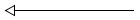
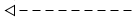
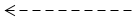
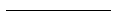
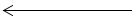

* content
{:toc}

# 第3章 Java 的基本程序设计结构

## 3.3 数据类型

### 3.3.4 boolean 类型

整型与布尔型之间不能转换。

> C++ vs. Java（数值转换为布尔值）
> 在C++中，数值或指针可以代替boolean值。值0相当于false，非0相当于true。因此，C++代码可能会出现以下错误代码：   if(x = 0) // 实际应是判等 x == 0   但 Java 不会出现这种错误，因为赋值表达式“x   = 0”返回值为0，不是布尔类型的值，所以不能置于if判断中，会出现编译错误。 

## 3.4 变量

与大多数程序设计语言相比，Java中“字母”和“数字”的范围要大。

字母：’A’~’Z’、’a’~’z’、’_’、’$’、某种语言中代表字母的任何Unicode字符。

数字：’0’~’9’、某种语言中代表数字的任何字符。

变量名长度无限制。

判断Unicode字母属于Java中的“字母”：Character.isJavaIdentifierStart()、Character.isJavaIdentifierPart()

尽管 $ 是合法字符，但应避免使用，它只用在Java编译器或其他工具生成的名字中。

### 3.4.1 变量初始化


### 3.4.2 常量

Java 用final 指示常量。

const是Java保留关键字，但目前没有使用。

## 3.7

### 3.7.1 读取输入

对于Scanner输入是可见的，故不适合从控制台读取密码。此时，需要使用Console类（Java 6.0新增）。

```java
Console console = System.console();   
String username = console.readLine(“User   name:”);  
Char[] password = console.readPassword(“Password:”);   
```

为安全起见，返回的密码存放在一维字符数组中，而不是字符串中。

对密码进行处理之后，应该马上用一个填充值覆盖数组元素。

### 3.7.2 格式化输出

每一个以 % 字符开始的格式说明符都用相应的参数替换。

可以格式化输出各种标志。

转换符参考、标志参考、日期和时间转换符参考

可以使用s转换符格式化任意的对象。实现Formattable接口的对象都将调用formatTo方法；否则调用toString方法。

指定参数索引：索引必须紧跟 % 后，并以 $ 终止。

前向引用：%<x，以 < 指定再次引用上一个参数。

参数索引值从1开始，而非0，避免与0标志混淆。

## 3.8

### 3.8.1 块作用域

块（block），即复合语句，指由一对花括号括起来的若干条简单Java语句。确定变量作用域。可嵌套。

不能在嵌套的两个块中声明同名的变量。

> C++ vs. Java：
C++中，可以在嵌套块中重定义一个变量。内层定义的变量会覆盖外层定义。
这有可能导致程序设计错误，Java中不允许。

### 3.8.5 多重选择：switch语句

switch 语句可能存在“贯穿(fallthrough)”问题，即case 分支语句末尾没有break语句。

对于贯穿问题，如果要进行相关编译检查需加上 -Xlint:fallthrough 选项；如果这是编程技巧造成的，可以使用注解 @SuppressWarnings(“fallthrough”) 抑制。

<div style='background-color:LightPink'>switch语句的贯穿现象是很容易理解的。因为，从形式上来说，case分支类似标签的概念，只有跳转到的能力，而没有跳转出的能力。所以，如果不使用break跳出，就会顺序执行。</div>
## 3.10

### 3.10.3 数组拷贝

> C++ vs. Java：
> Java数组与C++数组在堆栈上有很大不同，但基本上与分配在堆（heap）上的数组指针一样。即一个Java的int数组（int[] a）等同于C++的int指针（int* a）。

[] 运算符被预定义为检查数组边界，而且没有指针运算。

# 第4章 对象与类

## 4.1 面向对象程序设计概述

### 4.1.4 类之间的关系

常见类间关系：

* 依赖（users-a） 类的方法操纵另一个类的对象

* 聚合（has-a）   类A的对象包含类B的对象

* 继承（is-a）      特殊与一般的关系

应该尽可能地将相互依赖的类减至最少。让类之间的耦合度最小。

从建模角度看，“聚合”的概念可以用“关联”来替换。

表达类关系的UML符号

| 关系     | UML连接符                                                    |
| -------- | ------------------------------------------------------------ |
| 继承     |  |
| 接口实现 |  |
| 依赖     |  |
| 聚合关联 |  |
| 关联     |  |
| 直接关联 |  |

## 4.2 使用预定义类

### 4.2.1 对象与对象变量

@ http://jcp.org/en/jsr/detail?id=310 (Java日期类库重新设计资料)

> C++ vs. Java（对象变量与引用类型）
> Java对象变量与C++的引用不同。
> C++中没有空引用，并且引用不能被赋值。
> 可以将Java对象变量看作C++的对象指针。
> Java中的null引用对应C++中的NULL指针。

### 4.2.2 Java类库中的GregorianCalendar类

时间是用距离一个固定时间点的毫秒数（可正可负）表示的，这个点就是所谓的纪元（epoch），它是UTC（Coordinated Universal Time）时间1970年1月1日00:00:00。

### 4.2.3 更改器方法与访问器方法

> C++ vs. Java（访问器与更改器）
> C++中，带有const后缀的方法是访问器方法；默认为更改器方法。
> Java中，访问器方法与更改器方法在语法上没有明显的区别。

## 4.3 用户自定义类

### 4.3.5 隐式参数与显式参数

> C++ vs. Java（方法定义）
> C++中，通常在类的外面定义方法。如果在类的内部定义方法，这个方法将自动地成为内联（inline）方法。
> Java中，方法必须在类的内部定义，是否为内联方法是JVM确定的。即时编译器会监视调用那些简洁、经常被调用、没有被重载以及可优化的方法。

### 4.3.6 封装的优点

不要编写返回引用可变对象的访问器方法。

如果需要返回一个可变对象的引用，应该首先对它进行克隆（clone）。

## 4.4 静态域与静态方法

### 4.4.2 静态常量

System.out 被声明为final，但System.setOut()方法却可以改变，原因是该方法是一个本地方法。本地方法可以绕过Java语言的存取控制机制。

### 4.4.3 静态方法

> C++ vs. Java（static）
> 起初，static关键字由C引入，表示退出一个块后依然存在的局部变量。变量一直存在，当再次进入该块时仍然存在。
> 随后，C重用static关键字，表示不能被其他文件访问的全局变量和函数。
> 最后，C++再次重用该关键字，表示属于类且不属于类对象的变量和函数。这与Java同义。

## 4.6 对象构造

### 4.6.8 对象析构与finalize方法

不要依赖于使用finalize方法回收任何短缺资源，因为不确定该方法何时被调用。

System.runFinalizersOnExit(true)确保finalize方法在Java关闭前被调用，但不安全，不推荐使用。应使用Runtime.addShutdownHook添加“关闭钩”（shutdown hook）。

<div style='background-color:LightPink'>很少会有必要重写finalize 方法，因为通常情况下，一般不会有“资源”会与某个引用它的对象的生命周期一样长。
目前，我也只在封装RFT（IBM的一个测试工具）测试对象时，重写了封装对象的finalize方法，用以注销引用的测试对象。
这是一个典型场景，测试对象是一种“资源”，被封装对象持有，并在封装对象生命周期内都可能使用，但封装对象生命周期结束时，不得不注销测试对象，否则可能引起内存溢出。所以，在封装对象finalize方法中注销测试对象是最恰当的。
</div>

# 第5章 继承

## 5.1 类、超类和子类

关键字extends表明正在构造的新类派生于一个已存在的类。已存在的类称为超类（superclass）、基类（base class）或父类（parent class）；新类称为子类（subclass）、派生类（derived class）或孩子类（child class）。

前缀“超”和“子”来源于计算机科学和数学理论中的集合语言的术语。

Super跟this不同，因为它不是一个对象的引用，不能将super赋给另一个对象变量，而只是一个指示编译器调用超类方法的特殊关键字。

### 5.1.1 继承层次

继承并不仅限于一个层次。由一个公共超类派生出来的所有类的集合被称为继承层次（inheritance hierarchy）。在继承层次中，从某个特定的类到其祖先的路径被称为该类的继承链（inheritance chain）。

### 5.1.3 动态绑定

重载解析（overloading resolution）

### 5.1.4 阻止继承：final类和方法

如果将一个类声明为final，只有其中的方法自动地成为final，而不包括域。

### 5.1.5 强制类型转换

进行类型转换的唯一原因是：在暂时忽视对象的实际类型之后，使用对象的全部功能。

将一个值存入变量时，编译器将检查是否允许该操作。

##  5.2 Object：所有类的超类

### 5.2.2 相等测试与继承

自反、对称、传递、一致

Timestamp类继承自java.util.Date，而后者的equals方法使用一个instanceof测试，这样一来就无法覆盖实现equals使之同时做到对称且正确。

编写完美equals方法建议：

1. 显式参数命名为otherObject，稍后需要将它转换成另一个叫做other的变量。

2. 检测this与otherObject是否引用同一个对象：if(this == otherObject) return true;（优化）

3. 检测otherObject是否为null，如果为null，返回false。If(otherObject == null) return false;（必要）

4. 比较this与otherObject是否属于同一个类。如果equals的语义在每个子类中有所改变，就使用getClass检测：if(getClass() != otherObject.getClass()) return false;；如果所有子类都拥有统一的语义，就使用instanceof检测：if(!(otherObject instanceof ClassName)) return false;

5. 将otherObject转换为相应的类类型变量：ClassName other = (ClassName)otherObject;

6. 对所有需要比较的域进行比较。使用==比较基本类型域，使用equals比较对象域。如果都匹配，返回true；否则返回false。

## 5.4 对象包装器与自动装箱

> 自动装箱（autoboxing）：自动打包（autowrapping）或许更加合适，而“装箱（boxing）”这个词源自于C#。

> Integer n = 3;
> n++;
> 说明：赋值语句涉及自动装箱。要注意的是“n++”，n是Integer类型，是不可变对象，之所以可以自增是因为：编译器将自动地插入一条对象拆箱指令，然后进行自增计算，最后再将结果装箱。

自动装箱规范要求boolean、byte、char<=127，介于-128~127之间的short和int被包装到固定的对象中。

装箱和拆箱是编译器认可的，而不是虚拟机。编译器在生成类的字节码时，插入必要的方法调用。虚拟机只是执行字节码。

## 5.5 参数数量可变的方法

（兼容性）可以将已经存在且最后一个参数是数组的方法重新定义为可变参数的方法，而不会破坏任何已经存在的代码 

## 5.7 反射

反射（reflective）：能够分析类能力的程序。 

反射是一种功能强大且复杂的机制。使用它的主要人员是工具构造者，而不是应用程序员。

### 5.7.1 Class类

> 技巧：给用户一种启动速度比较快的幻觉。
> 确保包含main方法的类没有显式地引用其他的类。显示一个启动画面，通过调用Class.forName手工地加载其他的类。

一个Class对象实际上表示的是一个类型，而这个类型未必一定是一种类。

> 例如，int不是类，但int.class是一个Class类型的对象。

鉴于历史原因，Class.getName方法在应用于数组类型的时候会返回一个很奇怪的名字。

### 5.7.6 调用任意方法

> 微软公司为自己的非标准Java语言J++（以及后来的C#）增加了另一种被称为委托（delegate）的方法指针类型，它与Method类不同，而内部类比委托更加有用。

## 5.8 继承设计的技巧

不要使用受保护的域。

除非所有继承的方法都有意义，否则不要使用继承。

在覆盖方法时，不要改变预期的行为。

#  第6章 接口与内部类

## 6.1 接口

在Java程序设计语言中，接口不是类，而是对类的一组需求描述，这些类要遵从接口描述的统一格式进行定义。 

Comparable.compareTo() 应该是反对称的，即x.compareTo(y)和y.compareTo(x)返回数值应具有相反符号或同时抛出异常。

如果存在这样一种通用算法，它能够对两个不同的子类对象进行比较，则应该在超类中提供一个compareTo方法，并将这个方法声明为final。 

### 6.1.1 接口的特性

与接口中的方法都自动地被设置为public一样，接口中的域将被自动设为public static final。

## 6.2 对象克隆

> 在Object类中，clone方法被声明为protected，而所有类都是Object的子类。
> 为什么在自定义的类A中不能直接调用anObject.clone()呢？

<div style='background-color:LightPink'>对象的protected成员或构造器在声明它的包的外部，只能被负责实现该对象的代码所访问。 ——《Java语言规范》</div>
所有的数组类型均包含一个public 的clone方法。

## 6.4 内部类

嵌套是一种类之间的关系，而不是对象之间的关系。

### 6.4.1 使用内部类访问对象状态

内部类对象拥有一个对外围类对象的引用，但该引用在内部类定义中不可见。

外围类的引用在构造器中设置。编译器修改了所有的内部类的构造器，添加一个外围类引用的参数。

### 6.4.3 内部类是否有用、必要和安全

内部类是一种编译器现象，与虚拟机无关。编译器将会把内部类翻译成用$分隔外部类名与内部类名的常规类文件，而虚拟机对此一无所知。

如果使用UNIX，并以命令行的方式提供类名，就需要将$字符进行转义（\）。

编译器为了引用外围类，会生成一个附加的实例域，自己编写的代码中不能够引用它。

### 6.4.5 由外部方法访问final变量

编译器必须检测对局部变量的访问，为每一个变量建立相应的数据域，并将局部变量拷贝到构造器中，以便将这些数据域初始化为局部变量的副本。

### 6.4.6 匿名内部类

由于构造器的名字必须与类名相同，而匿名类没有类名，所以，匿名类不能有构造器。取而代之的是，将构造器参数传递给超类（superclass）构造器。尤其是在内部类实现接口的时候，有不能有任何构造参数。

> 技巧：“双括号初始化”（double brace initialization），用于创建匿名列表并添加元素。
> `invite(new ArrayList<String>() { { add(“Eric”); add(“Zong”) } });`
> 说明：外层括号建立了ArrayList的一个匿名子类，内层括号则是一个对象构造块。

### 6.4.7 静态内部类

声明在接口中的内部类自动成为static和public类。

## 6.5 代理

对于特定的类加载器和预设的一组接口来说，只能有一个代理类。Proxy.getProxyClass() 可获取这个类：

Class proxyClass = Proxy.getProxyClass(null, interfaces);

代理类一定是public和final。如果代理类实现的所有接口都是public，代理类就不属于某个特定的包；否则，所有非公有的接口都必须属于同一个包，同时，代理类也属于这个包。

# 第11章 异常、断言、日志和调试

## 11.1 处理错误

### 11.1.1 异常分类

RuntimeException 这个名字很容易让人混淆。实际上，现在讨论的所有错误都发生在运行时。

### 11.1.2 声明已检查异常

不需要声明Java的内部错误，即从Error继承的错误。任何程序代码都具有抛出那些异常的潜能，而我们对其没有任何控制能力。

> C++ vs. Java（抛出异常）
> Java中的throws说明符与C++中的throw说明符基本类似，但有一点重要的区别。
> 在C++中，throw说明符在运行时执行，而不是在编译时执行。也就是说，C++编译器将不处理任何异常规范。但是，如果函数抛出的异常没有出现在throw列表中，就会调用unexpected函数，这个函数的默认处理方式是终止程序的执行。
> 另外，在C++中，如果没有给出throw说明，函数可能会抛出任何异常。而在Java中，没有throws说明符的方法将不能抛出任何已检查异常。

### 11.1.3 如何抛出异常

> C++ vs. Java（抛出异常类型）
> 在C++与Java中，抛出异常的过程基本相同，只有一点微小的差别。在Java中，只能抛出Throwable子类的对象，而在C++中，却可以抛出任何类型的值。

## 11.2 捕获异常

### 11.2.1 捕获多个异常

捕获多个异常时，异常变量隐含为final变量。

捕获多个异常不仅会让代码看起来更简单，还会更高效。生成的字节码只包含一个对应公共catch子句的代码块。 

### 11.2.2 再次抛出异常与异常链

应使用throwable.init()包装原始异常。

Java 7之前，泛化捕获异常重抛后，方法不能声明抛出具化的异常。但Java 7是合法的。 

### 11.2.3 finally子句

> InputStream in = ...;
> try
> {
>   try
>   {
>     code that might throw exception
>   }
>   finally
>   {
>     In.close();
>   }
> }
> catch(IOException e)
> {
>   show error message
> }
> 内层的try语句块只有一个职责，就是确保关闭输入流。外层的try语句块也只有一个职责，就是确保报告出现的错误。
> 这种设计方式不仅清楚，而且还具有一个功能，就是将会报告finally子句中出现的错误。

### 11.2.4 带资源的try语句

finally块抛出的异常会抑制try块抛出的异常，带资源的try语句则不会，原来的异常会重新抛出，而close方法抛出的异常会“被抑制”，这些异常将自动捕获，并由addSuppressed方法增加到原来的异常，可调用getSuppressed方法获取。

带资源的try语句自身也可以有catch子句和一个finally子句。这些子句会在关闭资源之后执行。不过在实际中，一个try语句中加入这么多内容可能不是一个好主意。

## 11.4 使用断言

assert 条件:表达式

“表达式”部分的唯一目的是产生一个消息字符串。AssertionError对象并不存储表达式的值，因此，不可能在以后得到它。正如JDK文档所描述的那样：如果使用表达式的值，就会鼓励程序员试图从断言中恢复程序的运行，这不符合断言机制的初衷。

### 11.4.1 启用和禁用断言

在启用或禁用断言时不必重新编译程序。启用或禁用断言是类加载器（class loader）的功能。当断言被禁用时，类加载器将跳过断言代码，因此，不会降低程序运行的速度。

Java -ea:MyClass -ea:com.mycompany.mylib... MyApp

将开启MyClass类以及在com.mycompany.mylib包和它的子包中的所有类的断言。选项-ea将开启默认包中的所有类的断言。

禁用断言：-disableassertions或-da

Java -ea:... -da:MyClass MyApp

启用和禁用所有断言的-ea和-da开关不能应用到那些没有类加载器的“系统类”上。对于这些系统类来说，需要使用-enablesystemassertions/-esa开关。

## 11.6 调试技巧

捕获错误流：

Java MyProgram 2> errors.txt

同时捕获输出流和错误流：

Java MyProgram >& errors.txt

-Xlint 选项：

-Xlint 或 -Xlint:all                执行所有检查

-Xlint:deprecation                  检查废弃方法

-Xlint:fallthrough                   检查switch语句中是否缺少break语句

-Xlint:finally                           警告finally子句不能正常地执行

-Xlint:none                             不执行任何检查

-Xlint:path                              检查类路径和源代码路径上的所有目录是否存在

-Xlint:serial                            警告没有serialVersionUID的串行化类

-Xlint:unchecked                    对通用类型与原始类型之间的危险转换给予警告

# 第12章 泛型程序设计

## 12.2 定义简单泛型类

类型变量使用大写形式，且比较短，这是很常见的。在Java库中，使用变量E表示集合的元素类型，K和V分别表示表的关键字与值的类型。T（需要时还可以用临近的字母U和S）表示“任意类型”。 

12.4 类型变量的限定

`<T extends BoundingType>`

表示T应该是绑定类型的子类型（subtype）。T和绑定类型可以是类，也可以是接口。选择关键字extends的原因是更接近子类的概念，并且Java的设计者也不打算在语言中再添加一个新的关键字（如sub）。

 一个类型变量或通配符可以有多个限定，例如：

T extends Comparable & Serializable

限定类型用“&”分隔，而逗号用来分隔类型变量。

在Java的继承中，可以根据需要拥有多个接口超类型，但限定中至多有一个类。如果有一个类作为限定，它必须是限定列表中的第一个。 

## 12.5 泛型代码和虚拟机

虚拟机没有泛型类型对象——所有对象都属于普通类。在泛型实现的早期版本中，甚至能够将使用泛型的程序编译为在1.0虚拟机上运行的类文件！这个向后兼容性在Java泛型开发的后期被放弃了。

原始类型用第一个限定的类型变量来替换，如果没有给定限定就用Object替换。

为了提高效率，应该将标签（tagging）接口放在边界列表的末尾。

###  12.5.2 翻译泛型方法

有关Java泛型转换的事实：

* 虚拟机中没有泛型，只有普通的类和方法
* 所有的类型参数都用它们的限定类型替换
* 桥方法被合成来保持多态
* 为保持类型安全性，必要时插入强制类型转换 

## 12.6 约束与局限性

### 12.6.3 不能创建参数化类型的数组

数组会记住它的元素类型，如果试图存储其他类型的元素，就会抛出一个ArrayStoreException异常。不过对于泛型类型，擦除会使这种机制无效。因此，不允许创建参数化类型的数组，但声明是合法的。

可以声明通配类型的数组，然后进行类型转换：

`Pair<String>[] table = (Pair<String>[])new Pair<?>[10];`

###  12.6.4 Varargs警告

@SafeVarargs标注可消除创建泛型数组有关限制：

`@SafeVarargs static <E> E[] array(E... array) { return array; }`

但存在潜在风险：

```java
Pair<String>[] table = array(pair1, pair2);
Object[] objarray = table;
objarray[0] = new Pair<Employe>();
```

这能顺利运行而不会出现ArrayStoreException（因为数组存储只会检查擦除的类型），但在处理table[0]时会在别处得到一个异常。

### 12.6.5 不能实例化类型变量

表达式T.class是不合法的。

12.6.6 泛型类的静态上下文中类型变量无效

不能在静态域或方法中引用类型变量。

### 12.6.7 不能抛出或捕获泛型类的实例

既不能抛出也不能捕获泛型类对象。实际上，甚至泛型类扩展Throwable都是不合法的。

在异常规范中使用类型变量是允许的：

```java
public static <T extends Throwable> void doWork(T t) throws T
{
  try
  {
    do work
}
Catch(Throwable realCause)
{
  t.initCause(realCause);
  throw t;
}
}
```

Java异常处理的一个基本原则是，必须为所有已检查异常提供一个处理器。不过可以利用泛型消除这个限制。关键在于以下方法：

```java
@SuppressWarnings(“unchecked”)
public static <T extends Throwable> void throwAs(Throwable e) throws T
{
  throw (T)e;
}
```

###  12.6.8 注意擦除后的冲突

泛型规范：要想支持擦除的转换，就需要强行限制一个类或类型变量不能同时成为两个接口类型的子类，而这两个接口是同一接口的不同参数化。

## 12.8 通配符类型

### 12.8.1 通配符的超类型限定

带有超类型限定的通配符可以向泛型对象写入，带有子类型限定的通配符可以从泛型对象读取。

#  第13章 集合

##  13.1 集合接口

### 13.1.2 Java类库中的集合接口和迭代器接口

Collection 接口扩展了 Iterable 接口。因此，对于标准类库中的任何集合都可以使用“for each”循环。

应该将Java迭代器认为是位于两个元素之间。当调用next时，迭代器就超过下一个元素，并返回刚刚越过的那个元素的引用。

## 13.2 具体的集合

### 13.2.1 链表

add方法只依赖于迭代器的位置，而remove方法依赖于迭代器的状态。

对于并发修改列表的检测有一个奇怪的例外。链表只负责跟踪对列表的结构性修改，例如，添加元素、删除元素。set操作不被视为结构性修改。可以将多个迭代器附加给一个链表，所有的迭代器都调用set方法对现有结点的内容进行修改。

LinkedList.get()方法做了微小的优化：如果索引大于size()/2就从列表尾端开始搜索元素。

###  13.2.2 数组列表

Vector类的所有方法都是同步的。ArrayList方法不是同步的。

### 13.2.4 树集

将一个元素添加到树中要比添加到散列表中慢，但是，与将元素添加到数组或链表的正确位置上相比还是快很多的。

### 13.2.5 对象的比较

`Comparator<T>`接口声明了两个方法：compare和equals。当然，每一个类都有一个equals方法；因此，为这个接口声明再添加一个equals方法似乎没有太大好处。API文档解释说，不需要覆盖equals方法，但这样做可能会在某些情况下提高性能。例如，如果从另一个集合添加元素，这个由使用相同比较器的另外一个集添加元素，TreeSet类中的addAll方法的效率会更高。

###  13.2.8 映射表

有3个视图：键集、值集合（不是集）、键/值对集。

keySet 既不是HashSet，也不是TreeSet，而是实现了Set接口的某个其他类的对象。

###  13.2.9 专用集与映射表类

当对键的唯一引用来自散列表条目时，WeakHashMap将与垃圾回收器协同工作一起删除键/值对。

WeakHashMap使用弱引用（weak references）保存键。

##  13.3 集合框架

###  13.3.3 集合与数组之间的转换

为什么不直接将一个Class对象传递给toArray方法。其原因是这个方法具有“双重职责”，不仅要填充已有的数组（如果足够长），还要创建一个新数组。

##  13.4 算法

###  13.4.1 排序与混排

Collections.sort()直接将所有元素转入一个数组，并使用一种归并排序的变体对数组进行排序，然后，再将排序后的序列复制回列表。

归并排序算法比快速排序要慢，但它是稳定的，即不需要交换相同的元素。

##  13.5 遗留的集合

###  13.5.2 枚举

在C++中，用迭代器作为参数十分普遍。在Java的编程平台中，只有极少程序员沿用这种习惯。传递集合要比传递迭代器更为明智。集合对象的用途更大。当接受方如果需要时，总是可以从集合中获得迭代器，而且，还可以随时地使用集合的所有方法。不过，可能会在某些遗留代码中发现枚举接口，因为这是在Java SE 1.2的集合框架出现之前，它们是泛型集合唯一可以使用的机制。

#  第14章 多线程

多任务（multitasking）：在同一刻运行多个程序的能力。

 多进程 vs. 多线程

每个进程都拥有自己的一整套变量；

线程共享数据，这有风险，但线程之间通信更有效、更容易，也更轻量级，创建、撤销线程开销小得多。

##  14.2 中断线程

如果线程被阻塞，就无法检测中断状态。在阻塞线程调用interrupt方法会产生Interrupted Exception异常中断。

被中断的线程可以决定如何响应中断。

 在中断状态被置位时调用sleep方法，不会休眠，而是将清除状态并抛出InterruptedException。

 Interrupted() vs. isInterrupted()

Interrupted() 静态方法，检测当前线程是否被中断，并清除中断状态；

isInterrupted() 实例方法，检验是否被中断，不改变中断状态。

##  14.3 线程状态

线程6种状态：

New（新创建）

Runnable（可运行）

Blocked（被阻塞）

Waiting（等待）

Timed waiting（计时等待）

Terminated（被终止）

###  14.3.2 可运行线程

在任何给定时刻，一个可运行的线程可能正运行也可能没有运行。

##  14.4 线程属性

### 14.4.1 线程优先级

要避免低优先级的线程被饿死。

### 14.4.3 未捕获异常处理器

线程的run方法不能抛出任何受检异常，但非受检异常会导致线程终止。

在线程死亡前，异常被传递到一个用于未捕获异常的处理器，它必须是一个实现Thread.UncaughtExceptionHandler接口的类。

可用setUncaughtExceptionHandler方法为任何线程设置一个处理器，或用Thread.setDefaultUncaughtExceptionHandler方法为所有线程设置一个默认处理器。

缺省情况下，默认处理器为空；独立线程处理器为该线程的ThreadGroup对象。

## 14.5 同步 

### 14.5.3 锁对象

ReentrantLock 保存代码块基本结构如下：

```java
myLock.lock();
try
{
  critical section
}
finally
{
  myLock.unlock();
}
```

 如果在临界区代码结束之前抛出了异常，finally子句将释放锁，但会使对象可能处理一种受损状态。

###  14.5.4 条件对象

由于历史原因，条件对象经常被称为条件变量（conditional variable）。

signalAll方法仅仅通知等待线程，可能条件已满足，应再次检测条件。

通常，对await的调用应在如下循环体中

```java
while(!(ok to proceed))
  condition.await();
```

###  14.5.8 Volatile 域

 如果向一个变量写入值，而这个变量接下来可能会被另一个线程读取，或者，从一个变量读值，而这个变量可能是之前被另一个线程写入的，此时必须使用同步。

volatile关键字为实例域的同步访问提供了一种免锁机制。如果声明一个域为volatile，那么编译器和虚拟机就知道该域是可能被另一个线程并发更新的。

 volatile变量不能提供原子性。

###  14.5.9 final变量

当一个域声明为final时，可以安全地访问该共享域。

###  14.5.10 死锁

当程序挂起时，键入Ctrl+\，将得到一个所有线程的列表。

 