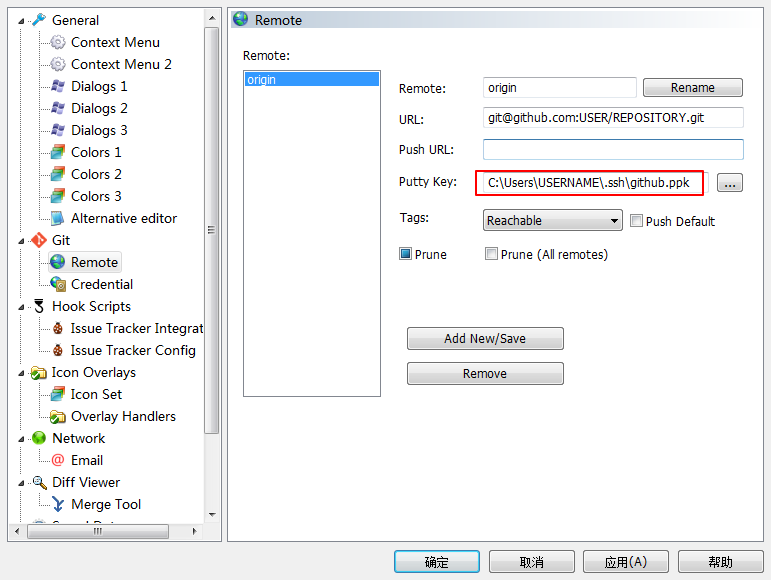
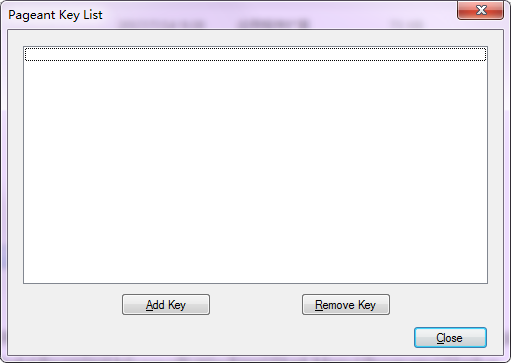
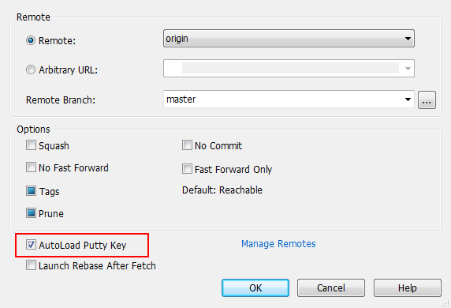
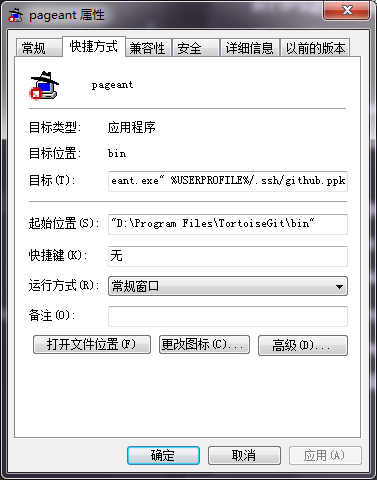

* content
{:toc}
# HTTPS访问及其缺点

使用 Git 最简单的方式就是通过 HTTPS 进行访问，这样就不需要过多的配置即可使用。想来应该有相当一部分初学者都会使用这种较为简单的方式使用 Git，笔者亦是如此。通常来说，这是“够用”的，但长久下来会发现并不“好用”。

主要的问题在于，使用 HTTPS 方式推送时，凭证的存储。默认 Git 每次都会询问用户名和密码，不过，Git 拥有一个凭证系统可以存储凭证（见“参考”部分链接），使得我们不必每次都输入用户名和密码。这个系统有多种方式存储凭证，可通过以下命令查看本地配置：

```shell
git config --global --get-regexp credential.helper
```

笔者的 Windows 系统环境使用的是 `credential.helper manager`，这是一种较常用的永久存储方式。But，长期使用过程中会发现，仍然可能存在凭证失效需要重新输入的情况，通常这发生在某个本地仓库“较长时间”不与远程仓库同步的状况下，但不尽然。我的同步操作通常是计划任务自动执行的，当切换到另一个工作环境拉取代码的时候才发现另一边的代码因为凭证莫名失效而推送失败，想像一下那种沮丧的心情吧！

因此，笔者决定尝试切换到 SSH。

> 注意，本文讨论的工作环境是 Windows 系统。

这里假设我们已经有了一个正常工作在 HTTPS 模式下的 Git 环境，下面我们一步步将其切换到 SSH 模式下来工作。

# 查看当前配置

为了确保环境是“干净”的，应该首先查看工作环境下 SSH 配置情况。

> 注意，以下命令如无特别说明都将在 Git bash 下执行，直到说明在 PowerShell 中使用时。

```bash
ls -al ~/.ssh
```

如果之前没有配置过 SSH，那么可能不存在 `~/.ssh` 目录，或它是空的。

> 如果该目录存在内容，确认不是你自己配置的，或与你共用当前系统用户的其他人所配置则可删除它们。

# 生成 SSH 密钥

这里我们先使用 Git 自带的 `ssh-keygen` 应用生成密钥对：

```bash
ssh-keygen -t rsa -b 4096 -C "your-email"
# Enter file in which to save the key (/c/Users/ericzong/.ssh/id_rsa):
# Enter passphrase (empty for no passphrase):
# Enter same passphrase again:
```

显然，你需要将上面命令中的 `your-email` 部分替换为自己的 GitHub 帐号绑定的邮箱地址。

执行该命令后，命令行会询问密钥文件的完整存储路径，按自己的需要填写或直接回车保持默认。随后会要求指定口令，这里我们直接回车不设置密码。

然后，密钥文件成功生成，假设我们指定的文件名为 `github`。那么，在指定存储路径下，会生成两个文件，`github`（私钥文件）和 `github.pub`（公钥文件）。

有了密钥文件，接下来就需要分别将私钥添加到本地配置以及将公钥添加到 GitHub 帐户。

# 将私钥添加到 ssh-agent

本地我们使用 Git 自带的 ssh-agent 来管理私钥，因此，我们需要启动 ssh-agent 并使用 Git 自带的 ssh-add 将私钥添加其中。

```bash
eval $(ssh-agent -s)
ssh-add ~/.ssh/github
```

这样，私钥就添加完成了。

# 将公钥添加到GitHub帐户

首先将公钥文件内容复制到剪贴板，可以使用以下命令：

```bash
clip < ~/.ssh/github.pub
```

如果没有 `clip` 应用，可使用文本编辑器直接打开 `github.pub` 复制其中内容。

然后登录 GitHub，页面右上角用户头像右边的下拉菜单中点击“Settings”，跳转到的页面中点击左侧导航菜单“SSH and GPG keys”，跳转到的页面中点击“New SSH key”按钮，跳转到的页面中填写“Title”（描述，可任意填写）和“Key”（粘贴之前复制的公钥），最后点击“Add SSH key”按钮。

至此，公钥也添加完成了。

# 修改仓库URL

在 HTTPS 模式下，仓库使用的是 HTTPS URL，需要替换为 SSH URL：

```bash
# 查看当前远程仓库 URL
git remote -v
# origin  https://github.com/USERNAME/REPOSITORY.git (fetch)
# origin  https://github.com/USERNAME/REPOSITORY.git (push)
# 修改为 SSH URL
git remote set-url origin git@github.com:USERNAME/REPOSITORY.git
# 再次查看确认修改
git remote -v
# 测试。如果返回你的用户名，则配置成功
ssh -T git@github.com
```

# 在PowerShell中使用

以上的命令都是在 Git bash 中执行，因此自然可以直接使用 Git 自带的应用命令。但是在 PowerShell 中通常会发现 Git 自带的应用命令都不可用，这是由于默认情况下 Git 安装时不会将 `bin` 目录添加到 PowerShell 的 `path` 中。

因此，我们需要将 Git 的 `bin` 目录添加到 PowerShell 的 `path` 中，通常将其添加到 `profile.ps1` 中：

```powershell
# ~/Documents/WindowsPowerShell/profile.ps1
$env:path += ";$Env:SCOOP/apps/git/current/bin;$Env:SCOOP/apps/git/current/usr/bin"
```

> 注意，笔者是使用 scoop 来管理应用的。追加的其实是 `Git/bin` 和 `Git/usr/bin` 两个目录。

这样，在 PowerShell 中就可以使用 Git 自带的应用命令了。

But，虽然使用 `ssh-agent` 可以启动 agent，但是当使用 `ssh-add` 添加私钥时出现了“Error connecting to agent: Connection refused”错误。

看来想在 PowerShell 中直接使用 Git 自带的 SSH 相关应用是有问题的。

好在我们可以借助一个名为 [posh-git](https://github.com/dahlbyk/posh-git) 的工具，它提供了在 PowerShell 中使用 SSH 的命令，你可以方便地用 scoop 安装它：

```powershell
scoop install posh-git
```

安装后，我们就可以使用其提供的命令了：

```powershell
# 启动 agent
start-sshagent
# 添加私钥
add-sshkey ~/.ssh/git
```

> 注意，posh-git 的 SSH 相关功能仍然依赖 Git 的相关应用命令，因此，将 Git 的 `bin` 目录加入 PowerShell 的 `path` 中仍是必要的。

至此，我们终于可以在 PowerShell 中使用 SSH 访问 GitHub 的仓库了。但是需要手动启动 agent 和添加私钥，想要自动完成也很简单，将这些命令加入 `profile.ps1` 即可。

```powershell
# ~/Documents/WindowsPowerShell/profile.ps1
start-sshagent
add-sshkey ~/.ssh/git
```

这样，只要打开 PowerShell 就可以直接使用 SSH 操作 Git 仓库了。

# 使用TortoiseGit

以上配置只对 PowerShell 有效，如果你还使用 TortoiseGit 的话，会发现经过以上修改，TortoiseGit 已经不能正常访问远程仓库了。

这是由于，TortoiseGit 不能使用 `ssh-keygen` 生成的密钥。而是需要使用 TortoiseGit 自带的工具“PuTTY Key Generator”来生成后缀为 `.ppk` 的私钥文件。我们可以通过搜索或是 `TortoiseGit/bin/puttygen.exe` 启动它。

## 转换生成`.ppk`私钥

由于我们已经通过 `ssh-keygen` 生成了私钥，因此只需要导入并保存为 `.ppk` 文件即可。在菜单中点击“Conversions → Import key”，选择之前生成的私钥文件即可。


加载私钥文件后，“Save private key”按钮将使能，点击它保存新的后缀为 `.ppk` 的私钥文件。

> Putty 也可以直接生成 `.ppk` 的私钥文件，点击“Generate”按钮并按提示操作即可。
>
> 只是这里如果再生成新的私钥文件，又需要再为 GitHub 帐户添加一次对应公钥，这是不必要的。

有了 `.ppk` 后缀的私钥文件，需要将其配置到 TortoiseGit。

## 配置Putty Key

在资源管理器中右击要配置的本地仓库根目录，在右键菜单中选择 “TortoiseGit → Settings”菜单，弹出配置对话框，将“Git → Remote”配置页面中的“Putty Key”栏位设置为新生成的私钥路径即可。



## 启动并配置Pageant

除此之外，还需要使用 Git 自带的 pageant 应用来加载验证私钥。pageant 位于 `TortoiseGit/bin/pageant.exe`，其界面很简单，点击“Add Key”选择 `.ppk` 文件即可。



至此，TortoiseGit 就可以正常操作远程仓库了。

## Pageant的启动

上面是手动启动 Pageant 并手动加载的私钥，但是由于我们为远程仓库配置了“Putty Key”，所以在操作远程仓库时可以自动启动 Pageant。比如，在拉取对话框中，只需要勾选“AutoLoad Putty Key”，那么即使此时没有启动 Pageant，TortoiseGit 也会自动启动它，并根据远程仓库的“Putty Key”配置加载私钥。



但是，可能我们还是希望 Pageant 能随系统自启并加载私钥，那么，我们可以为 `pageant.exe` 创建一个快捷方式，并在其属性对话框中为“目标”属性追加私钥文件路径，再将快捷方式放置于“启动”目录即可。



# 注意事项

关于密钥至少有一件事我们一直没有说明，就是密钥是可以添加密码保护的。

你应该还记得使用 `ssh-keygen` 生成密钥对时被询问设置密码，那时我们“留空”使得密钥没有密码保护。另外，Putty 在保存私钥时也会提示是否设置密码，也没有设置。

那么，是否需要设置密码呢？看你自己的需求。如果需要更高的安全性就应该设置密码——没有密码保护，那么只要拿到私钥文件就可以操作远程仓库了。

设置密码后对使用有什么影响呢？当没有密码时，你应该可以无障碍地顺利完成本文所有操作。但是，如果有密码，那么在各个添加私钥等环节通常就要求输入密码。这不是又变相出现使用 HTTPS 模式时所面对的问题了吗？而且，由于这种交互，自动的计划任务几乎是不可能完成的。

总之，如果不要求较高安全性的情况下，通常我们不需要为密钥添加密码保护。

# 命令汇总

```powershell
# 生成密钥
ssh-keygen -t rsa -b 4096 -C "your-email"
# 启动 agent（posh-git 命令）
start-sshagent
# 添加私钥（posh-git 命令）
add-sshkey /PATH/TO/PRIVATEKEY
# 查看远程仓库 URL
git remote -v
# 修改远程仓库 URL
git remote set-url origin git@github.com:USERNAME/REPOSITORY.git
# 测试
ssh -T git@github.com
```

# 注意事项

## 启动正确的ssh-agent

有可能按照以上配置，PowerShell 中仍然报 SSH 连接拒绝。可能的原因是：启动的 ssh-agent 来自于 OpenSSH 而非 Git 自带的。

你可以执行 `which ssh-agent` 或 `where ssh-agent` 来查看 ssh-agent 应用文件路径。

如果系统安装了 OpenSSH，且其位于 `System32` 目录下（如 Win10 内置的 OpenSSH），那么由于 `porfile.ps1` 中我们是向 `path` 追加的 Git `bin` 目录，因此 OpenSSH 路径下的 ssh-agent 先被搜索到，导致错误启动了 OpenSSH 的 ssh-agent。

解决方案很简单，将 Git `bin` 目录加在 `path` 之前即可：

```powershell
# ~/Documents/WindowsPowerShell/profile.ps1
$env:path += ";$env:SCOOP\apps\git\current\bin;$env:SCOOP\apps\git\current\usr\bin"
```

# 参考

[《Pro Git》Git 工具 - 凭证存储](https://git-scm.com/book/zh/v2/Git-%E5%B7%A5%E5%85%B7-%E5%87%AD%E8%AF%81%E5%AD%98%E5%82%A8)

[GitHub - posh-git](https://github.com/dahlbyk/posh-git)

