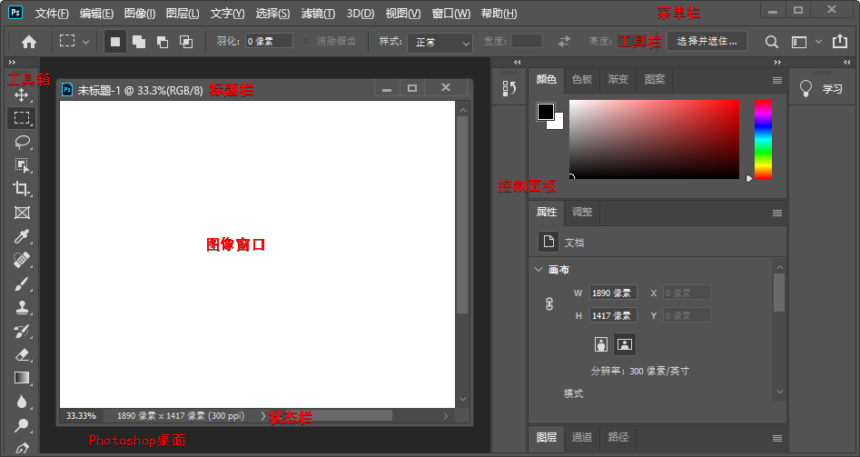

* content
{:toc}

# 图像基本

**数字图像**，使用电脑处理的图像。主要分为矢量图形和位图。

**矢量图形/向量图形/对象图形**，简称图形，由电脑指令描述和记录。可分解成若干个由点、线、面等构成的子图。可被任意缩小或放大，不会影响图形的清晰度或遗漏细节。

**位图**，由像素网或点风格组成的图像。其质量与分辨率有关，分辨率越大，图像质量越好，文件所占的存储空间越大。因为图像的像素数量是一定的，所以，当放大图像时，图像的质量会下降。

电脑显示器通过网格来显示图像，所以，矢量数据和位图数据在屏幕上均以像素显示。

Pixel（像素）= Picture（图像）+ Element（元素）

**像素**，位图的彩色点，是构成位图的最小成分。

**（图像）分辨率**，在水平或垂直方向上，单位长度内一条线由多少个像素描述。所用的像素越多，图像分辨率就越高。单位，Pixels Per Inch（像素/英寸），缩写为 PPI。

**颜色模式**，用于定义组成图像的颜色的数量和类别的系统。

> **灰度模式**，仅使用亮度定义颜色。亮度值表示，0（黑色）\~255（白色）；黑色油墨覆盖百分比表示（印刷图像），0%（白色）\~100%（黑色）。
>
> **位图模式**，黑白图像，仅使用黑白两种颜色值中的一种来表示像素。一般情况下，位图的位深度为 1，分辨率较低。**位深度/像素深度/颜色深度**，用于试题在图像中使用多少颜色信息来显示或打印像素。（1 位深度的像素有 2（2 的 1 次方）种颜色信息，即黑和白。
>
> **双色调模式**，PS 包含几种不同的色调模式，用户可以选择 1~4 种色彩创建单色调、双色调、三色调或四色调的彩色图像。
>
> **索引颜色模式**，系统会自动为图像建立一个索引色彩表，用来存储索引图像中的颜色。若原图像的颜色超出色彩表的范围，系统自动在色彩表中选择与之最接近的颜色来模拟。伪彩色，最多 256 种颜色。可减小文件大小，同时保持视觉上不降低图像品质。多用于 Web 图像或多媒体动画。
>
> **RGB 颜色模式**，使用红色（R）、绿色（G）、蓝色（B）来定义颜色，值为 0~255。为加色模型，使用透色光来显示颜色。值均为 255 时为白色，均为 0 时为黑色。
>
> **CMYK 颜色模式**，使用青色（C）、口红（M）、黄色（Y）、黑色（K）来定义颜色，值为 0%~100%。为减色模型，使用反射光来显示颜色。值均为 100 时为黑色，均为 0 时为白色。CMYK 颜色模式/CMYK 色空间，是印刷中使用的标准颜色模式。
>
> **Lab 颜色模式**，使用 L、a、b 来定义颜色。其中，L（光亮度分量）控制亮度，0\~100；a（色度分量）控制从绿到红的色度，+120\~-120；b（色度分量）控制从蓝到黄的色度，+120\~-120。Lab 颜色模式在色彩表达式范围上远超 RGB 模式和 CMYK 模式。可处理 Photo CD（照片光盘）图像，单独编辑图像的亮度及颜色。是 PS 在不同颜色模式之间转换的中间颜色模式。
>
> **多通道模式**，在每个通道中使用 256 个灰度级，通常用于特殊打印。

# 文件格式

PSD/PDD，PS 专用格式，可保存图像的图层、通道、蒙版等信息，便于设计图像效果，存储空间较大。

EPS（Encapsulated PostScript），应用非常广泛，可用于绘图或排版。可在排版软件中以低分辨率预览，而打印或出胶片时以高分辨率输出。支持 PS 所有颜色模式，但不支持 Alpha 通道，位图模式下支持透明。

TIFF（Tagged Image File Format，标记图像文件格式），便于应用程序之间和电脑之间进行图像数据交换。

GIF，压缩格式，只支持 8 位的图像文件。

BMP，MS-Windows 标准的位图文件格式。

JPEG（Joint Photographic Experts Group，联合摄影专家组），高倍率压缩，目前压缩率最高。以失真最小的方式丢掉数据。

# PS 界面

# 工具箱操作

工具箱中有很多工具按钮，单击选择并激活相应工具。

工具箱中的工具按钮可不止显示的这些，可以看到大多数工具按钮右下角都有一个小三角标志，表示该按钮隐藏着一个展开工具栏，其中还有若干个工具按钮。有 4 种方法可以选择隐藏在展开工具栏中的工具：

1. 在有三角形标志的工具按钮上按住鼠标左键片刻，会弹出展开工具栏供选择；

2. 在有三角形标志的工具按钮上右击，会弹出展开工具栏供选择；

3. 按住 `Alt` 键，连续单击有三角形标志的工具按钮，其展开工具栏中的工具会轮流被选中；

4. 按钮 `Shift` 键，连接按下有三角形标志的工具按钮的快捷键[^1]，其展开工具栏中的工具会轮流被选中。

[^1]: 工具按钮的快捷键在其展开工具栏中可以看到。

# 快捷键

| 键                    | 作用域  | 说明                                    | 备注           |
| --------------------- | ------- | --------------------------------------- | -------------- |
| `Tab`                 |         | 显示/隐藏所有打开的面板、选项组和工具箱 |                |
| `Shift` + `Tab`       |         | 显示/隐藏所有打开的面板                 |                |
| `Alt`/`Ctrl`          | 抓手    | 缩小/放大                               |                |
| `Alt`                 | 缩放    | 缩小                                    | 默认缩放是放大 |
| `Ctrl`                | 缩放    | 移动                                    |                |
| `Alt` + `上滚`/`下滚` |         | 放大/缩小                               |                |
| `Space`               |         | 抓手                                    |                |
| `F12`                 |         | 恢复图像到上一次保存时的状态            |                |
| 双击左键              | PS 桌面 | “打开”对话框                            |                |

