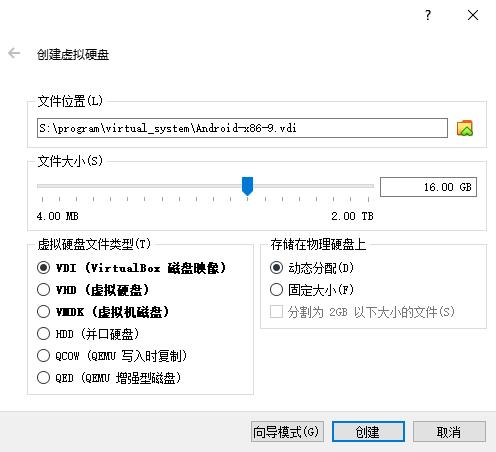
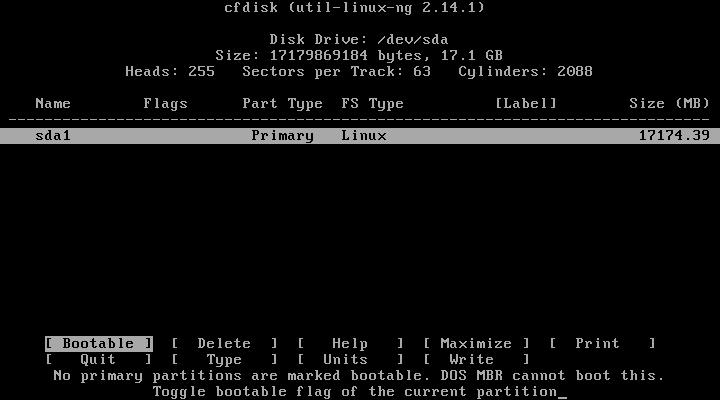
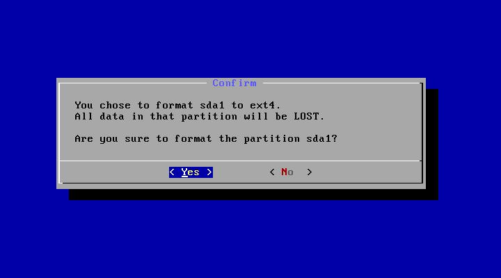
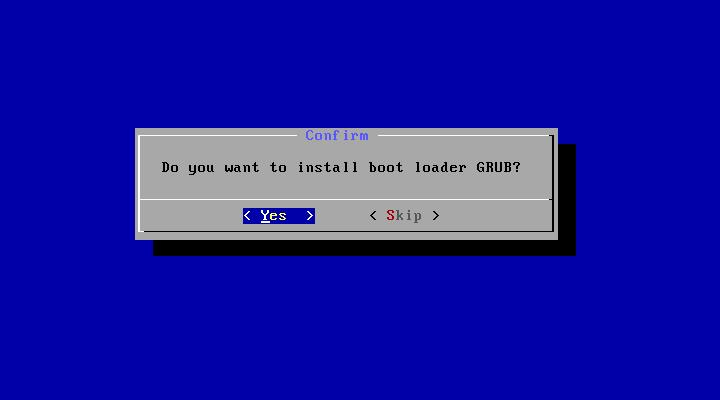

* content
{:toc}

# 准备工作

下载 VirtualBox 和 Android-x86：

* http://www.virtualbox.org/wiki/Downloads
* http://www.android-x86.org/download

并安装 VirtualBox。

# 创建与安装

运行 VirtualBox，点击“新建”，创建虚拟电脑，关键点在于选择系统类型和版本。

点击“创建”，还需要创建一个虚拟硬盘：

再点“创建”，虚拟电脑就创建好了。

在安装系统前，需要对该虚拟电脑进行一些设置。

在虚拟电脑列表中选中它，点击工具栏中的“设置”。

重点的设置项有以下一些：

* 系统/主板，勾选“网络”，指点设备选择“PS/2 鼠标”；
* 显示/屏幕，硬件加速勾选“启用3D加速”；
* 存储/存储介质，为光驱加载 Android 镜像文件。

这样就可以启动虚拟电脑了。启动将会加载 Adndroid 界面，通过光标下移选择“Installation”回车进行安装。

这里需要先创建分区：

不使用 GPT：

新建分区，移动光标选中“New”回车：

选中“Primary”回车：

默认大小，直接回车。

选中“Bootable”，回车设置为可启动分区；选中“Write”，回车写入分区信息，输入“yes”确认；再选中“Quit”退出：

然后，选择刚创建的分区，回车：

选择分区类型，这里我们选“ext4”，回国：

是否执行格式化，选“Yes”，回车：

进行系统安装，完成后，选择“Yes”：

再选择了“Yes”：

开始安装……然后选中“Reboot”，回车。

> 在 Reboot 前，请在设置/存储中，先移除光驱内容。

重启进入系统！

# FAQ

## 卡在启动

启动时，卡死在 detecting android-x86 found at /dev/sda1，这需要我们修改 GRUB。方法如下：

在启动选项页，按“e”编辑第一个启动条目，再按“e”进入下一级编辑。然后，向左移动光标，可以找到“quiet”字样，将其修改为“nomodeset xforcevesa”，回车返回，并按“b”启动。