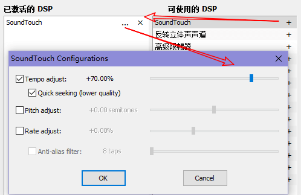

* content
{:toc}

# TC

## “关闭”按钮最小化

功能描述：点击“关闭”按钮时，TC 不退出，只是最小化。

功能配置：需要编辑配置文件 wincmd.ini ，修改属性 MinimizeOnClose，0（退出）｜1（最小化）。

# ConEmu

## 右键菜单

将如下文本拷贝到新创建的 .reg 文件：

```
Windows Registry Editor Version 5.00

[HKEY_CLASSES_ROOT\Directory\shell\ConEmu]
"Icon"="D:\\scoop\\apps\\conemu\\current\\ConEmu64.exe,0"

[HKEY_CLASSES_ROOT\Directory\shell\ConEmu\command]
@="\"D:\\scoop\\apps\\conemu\\current\\ConEmu64.exe\" /cmd \"PowerShell.exe\" -new_console:a:d:\"%1\""
```

双击或右键“合并”入注册表即可。

## 完全的单实例模式

如果“General”配置页面勾选了“单实例模式（使用现在窗口而不是运行新实例）”，其效果是仅会打开一个 ConEmu 窗口。

这里存在一个问题，仅执行 ConEmu(64).exe 只会打开一个窗口，但不会打开新标签页，即后续执行会被“忽略”。而我们通常期望打开一个新标签页。

因此，在“右键菜单”一节中，添加的右键命令不是单纯地执行 ConEmu64.exe，其实添加了很多参数：

`"...ConEmu64.exe" /cmd "PowerShell.exe" -new_console:a:d:"%1" `

这样，就做到了右键菜单会追加新标签页。

但是，通常我们也会把 ConEmu 这样常用的程序锁定到任务栏，而默认情况下，在任务栏中启动等效于直接执行 ConEmu。这会导致其和右键菜单打开不同的窗口，这不是我们期望的。

修正的方法很简单，右击任务栏上 ConEmu 图标，在弹出菜单中右击“Console Emulator (x64)”，再在弹出菜单中选择“属性”。在“属性”窗口的“快捷方式”标签页中将“目标”栏改为：

`...ConEmu64.exe /cmd "PowerShell.exe" -new_console:a:d:"E:"`

这样，任务栏和右键菜单启动的 ConEmu 都会在同一个窗口的不同标签页中显示了。

FAQ：这样的配置下还有一个小问题，如果首先是通过右键菜单打开的 ConEmu 窗口，该窗口会在任务栏以新增独立图标显示，而不是显示在锁定到任务栏的图标上。反之，不会有这个问题。

# foobar2000

## 变速播放

需要用到 foo_dsp_soundtouch 插件，请自行下载安装。

文件 → 参数选项(Ctrl+P) → 播放 → DSP管理器

右侧面板中，将“可使用的DSP”中“SoundTouch”加入“已激活的DSP”，并配置——勾选“Tempo adjust”并调整播放速度。



# Windows系统工具

```powershell
# MD5、SHA1、SHA256 工具
certutil -hashfile <filename> <MD5|SHA1|SHA256>
```

